# AWS Cloud Practitioner Course

# Compute in Cloud

## Objective

- Benefits of EC2 at basic level
- Different EC2 instances
- Differentiate between various billing options for EC2
- Benefits of EC2 Auto scaling
- Benefits of ELB
- SN (Simple Notification Service) vs SQS (Simple Queue Service)
- Additional Compute options

# EC2 (Elastic Compute Cloud)

- EC2 stands for Elastic Compute Cloud.
- EC2 is an **on-demand computing service** on the AWS cloud platform.
- Under computing, it includes all the services a computing device can offer to you along with the flexibility of a virtual environment.
- It also allows the user **to configure their instances as per their requirements** i.e. allocate the RAM, ROM, and storage according to the need of the current task.
- Even the user can dismantle the virtual device once its task is completed and it is no more required.
- EC2 allows you **to rent virtual computers**.
- EC2 has **resizable capacity**.
- EC2 offers **security, reliability, high performance, and cost-effective infrastructure** so as to meet the demanding business needs.

## **Benefits of EC2 (Elastic Compute Cloud)**

- EC2 - Highly flexible + cost effective + quick vs running own server on-premises
- AWS does following wrt EC2 -
    - Built data centres
    - Secured datacenters
    - Purchased servers
    - Installed server and are online ready to use
    - constantly operates massive amount of compute capacity, which can be used
- All customer need to do is **request, launch and boot** them, ready for use.
- When not required, they can be terminated, not locked in or stuck with servers not needed.
- **Pay-for-usage** - For EC2, **you pay for running instances**, not stopped or terminated ones.
- EC2 gives *flexibility* and *control* over configuration of those instances as well.
- One can provision EC2 instances on-demand, with blend of OS and configurations to power applications
- EC2 instances are resizable, one can start with a small instance , and then can add *more memory and more CPU (Vertical Scaling an instance)*
- One can also control networking aspect, meaning what type of requests make it  to the server and if they are publicly or privately accessible.

## **How does EC2 work ?**

- EC2 runs on top of physical host machines managed by AWS using virtualization technology.
- Multiple instances are created in a host (meaning VM are created), so not taking an entire host to yourself.
- Hypervisor running on host machine is responsible for sharing the underlying physical resources between VM.
- Multitenancy - sharing hardware ; shared cloud infrastructure
- Hypervisor managed by AWS, coordinates this multitenancy; is responsible for isolating VM with each other as they share resources from host, makes EC2 instance secure and separate (as one EC2 instance is not aware of any other instances on that host)

## **Instance Types**

- When selecting an instance type, consider-
    - compute
    - memory
    - storage capabilities
- **General Purpose instance type -**
    - *Balance of compute, memory and networking resources.*
    - Can be used for workloads such as -
        - Application & gaming servers
        - backend servers
        - small and medium databases
    - Eg. Application in which resource needs for compute, memory and networking are roughly equivalent, one might consider running this instance because the application does not require optimization in any single resource area
- **Compute Optimized Instance Type**
    - Ideal for *compute-bound applications benefit from high-performance processors.*
    - Can be used for same purpose as General purpose one, except different being compute optimized applications are ideal for -
        - high-performance web servers
        - compute-intensive applications server
        - dedicated gaming servers
        - batch-processing workloads that require processing many transactions in a single group
- **Memory Optimized Instance Type**
    - To *deliver fast performance for workloads that process large datasets in memory*
    - Eg. A workload that requires large amounts of data to be preloaded before running an application. Might be a *high-performance DB* or a workload that involves performing *real-time processing of a large amount of unstructured data.*
    - This instance enables you to *run workloads with high memory needs and receive great performance.*
- **Accelerated Computing Instances**
    - *Uses hardware accelerator, or coprocessors to perform some functions more efficiently that is possible in software running on CPUs.*
    - Eg. *floating-point number calculations, graphics processing, and data pattern matches, game and application streaming*
- **Storage Optimized Instances**
    - For workloads that require high, sequential read and write access to large datasets on local storage.
    - Eg. *Distributed file system, data warehousing application and high frequency online transaction processing (OLTP) systems.*
    - These instances are designed to deliver tens of thousands of low-latency, random IOPS to applications.
    - You can think of input operations as data put into a system, such as records entered into a database. An output operation is data generated by a server. An example of output might be the analytics performed on the records in a database. If you have an application that has a high IOPS requirement, a storage optimized instance can provide better performance over other instance types not optimized for this kind of use case.

## **EC2 Pricing**

- **On - demand Instances**
    - Ideal for short-term, irregular workfloads, cannot be interrupted.
    - No upfront cost, or minimum contracts
    - Instances run continuously until stopped and you pay for compute time
    - Not recommended for workload that can last year or longer
    - Eg: Developing, testing and applications that have *unpredictable usage patterns*.
- **Reserved instances (1 to 3 yr term)**
    - Billing discount applied to use of on-demand Instances
    - **Standard Reserved Instance**
        - Good fit if *you know the EC2 instance type and size you need for your steady-state applications and AWS region you want to run them.*
        - Needs following info -
            - Instance type and size - m5.xlarge
            - Platform (OS) - Windows Server vs Linux
            - Tenancy - Default (shared) vs Dedicated ([Ref](https://docs.aws.amazon.com/autoscaling/ec2/userguide/advanced-settings-for-your-launch-template.html#:~:text=to%20improve%20resiliency.-,Tenancy,-Amazon%20EC2%20provides))
            - Availability zone (optional) - Selecting this ensure you get EC2 capacity reservation, making sure that the desire amount of EC2 instances will be available when you need them.
    - **Convertible Reserved Instance**
        - Enable to *exchange* 1 or more Convertible Reserved Instance (CRI) for another CRI with a different configuration, including instance family, OS and tenancy.
        - There are no limit to how many times you perform an exchange, as long as the target CRI is of an equal or higher value that the CRI that you are exchanging.
- **EC2 instance Savings plan**
    - Reduces EC2 instance costs on making an *hourly spend commitment to an instance family and region for 1 to 3 year team.*
    - This term commitment results in *savings of up to 72% compared to on-demand rates.*
    - *Good option - If you need flexibility in your EC2 usage over duration of commitment term*
    - One have benefit of saving costs on running any EC2 instance with an EC2 instance family in a chosen Region (M5 usage in N. Virgnia) regardless of Availability Zone, instance size, OS and tennacy.
    - *Savings with EC2 instance Savings Plans are similar to saving provided by Reserved Instances, except for EC2 Instance Saving Plan you dont need to specify up front what EC2 instance type and size, OS and tenancy to get a discount.*
    - Saving plan does not include an EC2 capacity reservation option (meaning no need to commit certain number of instances over 1 to 3 year term)
- **Spot Instances**
    - an instance that uses spare EC2 capacity that is available for less than the On-Demand price
    - *Ideal for workloads with flexible start and end times, or that can withstand interruptions.*
    - Spot instances use unused Amazon EC2 computing capacity and offer you cost savings at up to 90% off of On-demand prices
    - Example -
        - Suppose that you have a background processing job that can start and stop as needed (such as the data processing job for a customer survey).
        - You want to start and stop the processing job without affecting the overall operations of your business.
        - If you make a Spot request and Amazon EC2 capacity is available, your Spot Instance launches.
        - *However, if you make a Spot request and Amazon EC2 capacity is unavailable, the request is not successful until capacity becomes available.* The unavailable capacity might delay the launch of your background processing job.
        - *After you have launched a Spot Instance, if capacity is no longer available or demand for Spot Instances increases, your instance may be interrupted.* This might not pose any issues for your background processing job.
        - However, in the earlier example of developing and testing applications, you would most likely want to avoid unexpected interruptions. Therefore, choose a different EC2 instance type that is ideal for those tasks.
- **Dedicated Host (Most expensive option)**
    - Physical server with EC2 instance capacity that is fully dedicated to your use.
    - One can purchase On-demand Dedicated Hosts and Dedicated Host Reservation.

## Scaling EC2

```
💡 Everything fails all the time, so plan for failure and nothing fails**
```

**Basic definitions -** 

- **Scaling up** is when you **change the instance types within your Auto Scaling Group to a higher type** (for example: changing an instance from a m4.large to a m4.xlarge), scaling down is to do the reverse.
- **Scaling out** is when you **add more instances to your Auto Scaling Group**
- **Scaling in** is when you r**educe the number of instances** in your Auto Scaling Group.
- When you scale out, you distribute your load and risk which in turn provides a more resilient solution, here is an example:
    - Let's say you have an ASG with 4x m4.xlarge instances. If one fails that means you lost 25% of your processing capability, it doesn't matter that these are sizeable instances with a good amount of CPU and RAM, the fact is by *having bigger instance types but less of them you increase the impact of a failure.*
    - However if you had say 8x m4.large instead, your total compute is the same as 4x m4.xlarge however if 1 instance dies then you only lose 12.5% of your resources.
    - **Typically its better to use more smaller instances than less larger ones, so you will see that its more common to "scale-out" to meet demand than it is to "scale-up".**
    - One last consideration is, in order to scale-up/scale-down you have to restart the instance, so there is a service impact when you scale-up/scale-down. There is no such impact when you scale-in/scale-out however.

- Scalability involves starting with resources you need and designing your architecture to automatically response to changing demand by scaling out (adding more instances) or scaling in.
- *To configure scaling process to happen automatically, we use EC2 Auto-Scaling Service*
- EC2 Auto Scaling enables to add or remove EC2 instances in response to changing application demand (able to automatically scale instances in and out as needed), thus maintaining a greater sense of application availability.
- Two Approaches -
    - Dynamic Scaling - Responds to changing demand
    - Predictive Scaling - automatically schedules right number of EC2 instances based on predicted demand
- *To scale faster, one would use them together.*

### Example of Auto-Scaling

- By adding Amazon EC2 Auto Scaling to an application, you can add new instances to the application when necessary and terminate them when no longer needed.
- Suppose that you are preparing to launch an application on Amazon EC2 instances. *When configuring the size of your Auto Scaling group, you might set the minimum number of Amazon EC2 instances at one. This means that at all times, there must be at least one Amazon EC2 instance running.*

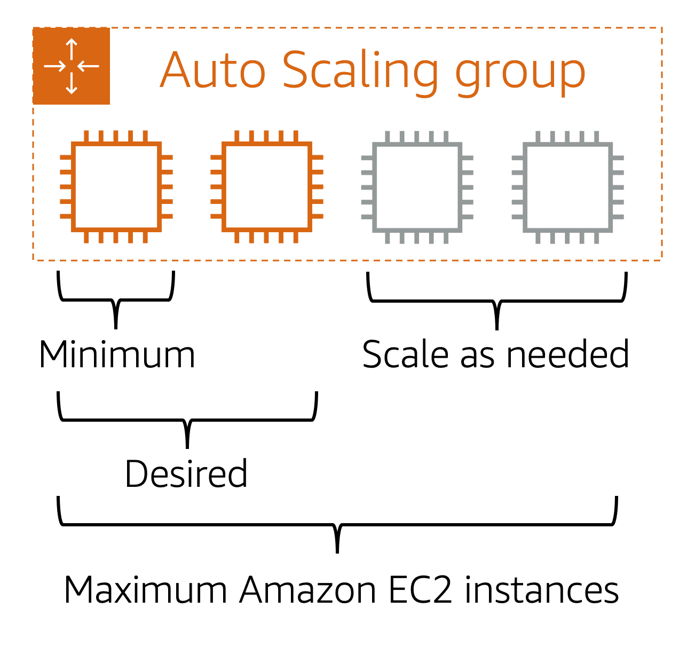

- you can set the **desired capacity** at two Amazon EC2 instances even though your application needs a minimum of a single Amazon EC2 instance to run.
- *If you do not specify the desired number of Amazon EC2 instances in an Auto Scaling group, the desired capacity defaults to your minimum capacity.*
- The third configuration that you can set in an Auto Scaling group is the **maximum capacity**. For example, you might configure the Auto Scaling group to scale out in response to increased demand, but only to a maximum of four Amazon EC2 instances.
- Because Amazon EC2 Auto Scaling uses Amazon EC2 instances, you pay for only the instances you use, when you use them. You now have a cost-effective architecture that provides the best customer experience while reducing expenses.

# Load Balancing

```
💡 The load balancer distributes incoming application traffic across multiple targets, such as EC2 instances, in multiple Availability Zones
```

- Method of distributing network traffic equally across a pool of resources that support an application.
- LB is a device that sits between the user and the server group and acts an an invisible facilitator, ensuring that all resource server are used equally.


### Benefits of LB

LB directs and controls internet traffic between the application server and client. As a result, it improves an applications’s availability, scalability, security and performance.

**How does it improve Application Availability ?**

- It increases the fault tolerance of system by automatically detecting server problems and redirecting client traffic to available servers.
- It runs application server maintenance or upgrade with any downtime
- It provides automatic disaster recovery to backup sites
- It performs health checks and prevent issues that can cause downtime

**How does it improve application scalability ?**

- It can be used to direct network traffic intelligently among multiple servers.
- It can prevent traffic bottlenecks at any one server
- It predicts application traffic so that you can add or remove different server, when req.
- It adds redundancy to system, thus scaling with confidence.

**How does it improve application security ?**

- LB has built-in security features to add another layer of security to internet appli.
- They are useful tool to deal with distributed denial-of-service (DOS) attacks
- It can monitor traffic and block malicious content
- It can automatically redirect attack traffic to multiple backend servers to minimize impact.
- It can route traffic through a group of network firewalls for additional security.

**How does it improve application performance ?**

- It does so by increasing response time and reducing network latency.
- It distributes load evenly between servers to improve application performance.
- It can redirect client requests to a geographically closer server to reduce latency.
- It can ensure reliability and performance of physical and virtual computing resources.

### How does LB work ?

User requests to the application first go to the load balancer. The load balancer then routes each request to a single server in the server farm best suited to handle the request.

### Type of Load balancing

*Categorized depending on the what LB checks in the client request to redirect the traffic*

**Application load balancing (ALB)**

- Modern applications have several server farms with multiple server dedicated to single application function.
- *ALB look at the request content such as HTTP headers or SSL session IDs to redirect traffic.*
- Example -
    - An e-commerce application has a -
        - product directory
        - shopping cart
        - checkout functions
    - The ALB sends requests for browsing products to server that contain images and videos but do not need to maintain open connections.
    - It sends shopping cart requests to servers that can maintain many client connections and save cart data for a long time.

**Network Load Balancing**

- Examine IP addresses and other network information to redirect traffic optimally.
- They can track source of application traffic and can assign a static IP address to several servers.

**Global Server Load Balancing**

- It occurs across several geographically distributed server.
- Example -
    - companies can have servers in multiple data centers, in different countries, and in third-party cloud providers around the globe.
    - In this case, local load balancers manage the application load within a region or zone.
    - They attempt to redirect traffic to a server destination that is geographically closer to the client.
    - They might redirect traffic to servers outside the client’s geographic zone only in case of server failure.

**DNS Load Balancing**

- One can configure a domain to route network requests across a pool of resources on the domain.
- A domain can correspond to a website, a mail system, a print server or another service that is made accessible through the internet.
- This type of LB is helpful for maintaining application availability and balancing network traffic across a globally distributed pool of resources.

## Elastic load Balancing

- Automatically distributes incoming application traffic across multiple resources, such as EC2 instances.
- LB acts as a single point of contact for all incoming web traffic to your auto-scaling group.
- This means that as you add or remove Amazon EC2 instances in response to the amount of incoming traffic, these requests route to the load balancer first.
- Then, the requests spread across multiple resources that will handle them.
- For example, if you have multiple Amazon EC2 instances, Elastic Load Balancing distributes the workload across the multiple instances so that no single instance has to carry the bulk of it.
- EC2 and LB work together to make sure applications running in EC2 can provide high performance and availability

## Messaging and Queuing

**Monolithic Applications & Microservices**

- Applications made of multiple components communicate with each other to transmit data, fulfill requests and keep the application running.
- Monolithic Application -
    - Tightly coupled components, components can be databases, servers, UI, business logic and so on.
    - If a single component fails, other components fail and possibly entire application.

```
💡 To help maintain application availability when a single component fails, you can design your application through a **micro-services** approach.
```

- Microservices -
    - Application components are loosely couples.
    - If a single component fails, the other components continue to work because they are communicating with each other.
    - Loose coupling prevents entire application from failing
- Two service facilitate integration :
    - SNS - Simple Notification Service
    - SQS - Simple Queue Service

### Amazon Simple Notification Service (SNS)

- Publish/subscribe service
- Eg. A publisher publishes messages to subscribers. Similar to coffee shop - cashier provides coffee orders to the barista who makes the drinks.
- Subscribers can be web servers, email addresses, AWS lambda.

### Amazon Simple Queue Service (SQS)

- Message Queuing Service
- One can send, store, receive messages between software components, without losing messages or requiring other services to be available.
- An application send messages into a queue. A user or service retrieves, processes it and deletes it from the queue.

# Global Infrastructure and Reliability

```
💡 High availability and Fault tolerance**
```

# Objectives

- Benefits of AWS Global Infrastructure
- Basic concept of Availability Zone
- Benefits of Amazon CloudFront and edge locations
- Compare different methods for provisioning AWS Services

# Selecting a Region

When determining the right Region for your services, data, and applications, consider the following four business factors.

### **Compliance with data governance and legal requirements**

- Depending on your company and location, you might need to run your data out of specific areas.
- For example, if your company requires all of its data to reside within the boundaries of the UK, you would choose the London Region.
- Not all companies have **location-specific data regulations**, so you might need to focus more on the other three factors.

### **Proximity to your customers**

- Selecting a Region that is **close to your customers will help you to get content to them faster**.
- For example, your company is based in Washington, DC, and many of your customers live in Singapore.
- You might consider running your infrastructure in the Northern Virginia Region to be close to company headquarters, and run your applications from the Singapore Region.

### **Available services within a Region**

- Sometimes, the closest Region **might not have all the features that you want to offer to customers**.
- AWS is frequently innovating by creating new services and expanding on features within existing services. However, making new services available around the world sometimes requires AWS to build out physical hardware one Region at a time.
- Suppose that your developers want to build an application that uses Amazon Braket (AWS quantum computing platform). As of this course, Amazon Braket is not yet available in every AWS Region around the world, so your developers would have to run it in one of the Regions that already offers it.

### **Pricing**

- Suppose that you are considering running applications in both the United States and Brazil.
- The way Brazil’s tax structure is set up, it might cost 50% more to run the same workload out of the São Paulo Region compared to the Oregon Region.

## Availability Zones

```
💡 Problem - You don’t want to run application with data centre in a single building, because data centre in one location can fail for any number of unavoidable reasons.**
```

- AWS has data centres all around the world.
- Each region is made up of multiple data centres.
- **Availability Zone (AZ) → Single or group of data centres.**
- **Each availability zone is one or more discrete data centres with redundant networking, power and connectivity.**
- *When you launch an Amazon EC2 instance, it launches a virtual machine on a physical hardware that is installed in an Availability Zone.*
- **Each AWS region consists of multiple isolated and physically separated AZ with a geographic region.**

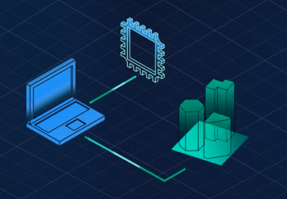

- AZ are build next to each other because if large scale incident were to occur (natural disaster), one could lose connectivity to everything in that AZ.
- Availability Zones are located **tens of miles apart from each other**. This is **close enough to have low latency** (the time between when content requested and received) between Availability Zones.
    - However, if a disaster occurs in one part of the Region, they are distant enough to reduce the chance that multiple Availability Zones are affected.
- **Do not run only 1 instances in 1 AZ.**

```
💡 Run across at least two Availability Zones in a Region
```

- Many of the AWS services **run at the Region level, meaning they run synchronously across multiple AZs without any additional effort on your part.**
- **Example → ELB is actually a regional construct.** It runs across all Availability Zones, communicating with the EC2 instances that are running in a specific Availability Zone.
- Regional services are by definition already highly available at no additional cost of effort on your part.
    
    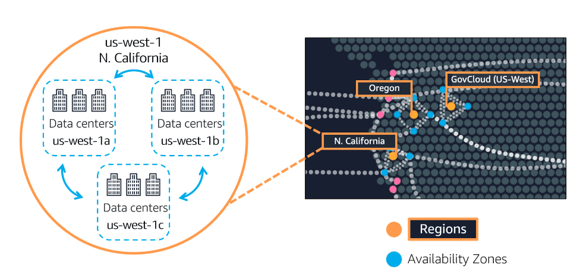
    

## Edge Locations

- When selecting region, one major criteria → Proximity to customers.
    - but what if you have customers all over the world or in cities that are not close to one of our Regions?
- Caching copies of data closer to the customers all around the world uses the concept of content delivery networks, or CDNs ([Content Delivery Network](https://www.notion.so/System-Design-Core-Concepts-110e0021eb2d80948c5bfde80305dae6?pvs=21)).
- **AWS CloudFront → Amazon’s CDN.**
    - Amazon CloudFront is a service that **helps deliver STATIC content, video, applications, and APIs to customers around the world with low latency and high transfer speeds**.
    - Amazon CloudFront uses what are called **Edge locations**, all around the world, to **help accelerate communication with users, no matter where they are.**
- Edge locations are **separate from Regions, so you can push content from inside a Region to a collection of Edge locations around the world**, in order to accelerate communication and content delivery.
- AWS Edge locations, also run more than just CloudFront.
    - They run a **domain name service, or DNS, known as Amazon Route 53**, helping direct customers to the correct web locations with reliably low latency.
- AWS Outposts, where AWS will basically install a fully operational mini Region, right inside your own data center. That's owned and operated by AWS, using 100% of AWS functionality, but isolated within your own building.

### Key Points

- **Regions are geographically isolated areas**, where you can access services needed to run your enterprise.
- **Regions contain Availability Zones**, that allow you to run across physically separated buildings, tens of miles of separation, while keeping your application logically unified.
    - Availability Zones help you solve high availability and disaster recovery scenarios, without any additional effort on your part.
- **AWS Edge locations run Amazon CloudFront to help get content closer** to your customers, no matter where they are in the world.

## Provision AWS Resources - How to interact with AWS resources ?

```
💡 Using AWS APIs → Pre-determined ways to interact with AWS services, one can invoke or call these APIs to provision, configure and manage AWS resources.
```

## AWS Management Console

- The AWS Management Console is **browser-based**.
- Through the console, you can **manage your AWS resources visually** and in a way that is easy to digest.
- Useful for →
    - Building out testing env
    - Viewing AWS bills
    - Monitoring
    - Working with non-tech resources
- Susceptible to human error.

## AWS Command Line Interface

- tool that allow you to script or program the API calls.
- The CLI allows you to make API calls **using the terminal on your machine**.
- Writing commands using the CLI **makes actions scriptable and repeatable**, such that one can write and run commands to launch an EC2 Instance.
- And if you want to launch another, **you can just run the pre-written command again**. This makes it **less susceptible to human error**. And you can have these scripts run automatically, like on a schedule or triggered by another process.

## AWS SDK (Software Development Kits)

- SDKs make it easier for you to use AWS services through an API designed for your programming language or platform. SDKs enable you to use AWS services with your existing applications or create entirely new applications that will run on AWS.

## Other Tools

### AWS Elastic Beanstalk

- AWS Elastic Beanstalk is a **service that helps you provision Amazon EC2-based** environments.
- Provide your **application code and desired configurations** to the AWS Elastic Beanstalk service, **which then takes that information and builds out your environment for you.**
- AWS Elastic Beanstalk also makes it easy to **save environment configurations, so they can be deployed again easily**.
- AWS Elastic Beanstalk **gives you the convenience of not having to provision and manage all of these pieces separately, while still giving you the visibility and control of the underlying resources**.
- You get to focus on your business application, not the infrastructure.

### AWS CloudFormation (Infrastructure As A Code)

- AWS CloudFormation is an **infrastructure as code tool** that allows you to define a wide variety of AWS resources in a declarative way using **JSON or YAML text-based documents** called **CloudFormation templates**.
- A declarative format allows you to **define what you want to build** without specifying the details of exactly how to build it.
    - CloudFormation lets you define what you want and the **CloudFormation engine will worry about the details on calling APIs to get everything built out**.
- Not limited to EC2 based solutions.
- CloudFormation supports many different AWS resources from storage, databases, analytics, machine learning, and more.
- Once you define your resources in a CloudFormation template, CloudFormation will parse the template and begin provisioning all the resources you defined in parallel.
- **CloudFormation manages all the calls to the backend AWS APIs for you.**
- You can run the **same CloudFormation template in multiple accounts or multiple regions**, and it will create identical environments across them.
- There is less room for human error as it is a totally automated process.

# Networking

# **Objectives**

- Describe the basic concepts of networking.
- Describe the difference between public and private networking resources.
- Explain a virtual private gateway using a real life scenario.
- Explain a virtual private network (VPN) using a real life scenario.
- Describe the benefit of AWS Direct Connect.
- Describe the benefit of hybrid deployments.
- Describe the layers of security used in an IT strategy.
- Describe the services customers use to interact with the AWS global network.

# VPC (Virtual Private Cloud)

- Own private network in AWS.
- A VPC allows you to define your private IP range for your AWS resources, and you place things like EC2 instances and ELBs inside of your VPC.
- Its a networking service that you can use **to establish boundaries around your AWS resources.**
- Amazon VPC enables you to **provision an isolated section of the AWS Cloud**. In this isolated section, **you can launch resources in a virtual network that you define**.
- Within a virtual private cloud (VPC), **you can organize your resources into subnets**.

### Subnets

- A **subnet** is a section of a VPC that can contain resources such as Amazon EC2 instances.
- Subnets are **chunks of IP addresses** in your VPC that allow you **to group resources together**.
- Subnets **control whether resources are either publicly or privately available**.

### Internet Gateway

- To allow public traffic from the internet to access your VPC, you attach an **internet gateway** to the VPC.
- An internet gateway is a connection between a VPC and the internet.
- Without an internet gateway, no one can access the resources within your VPC.

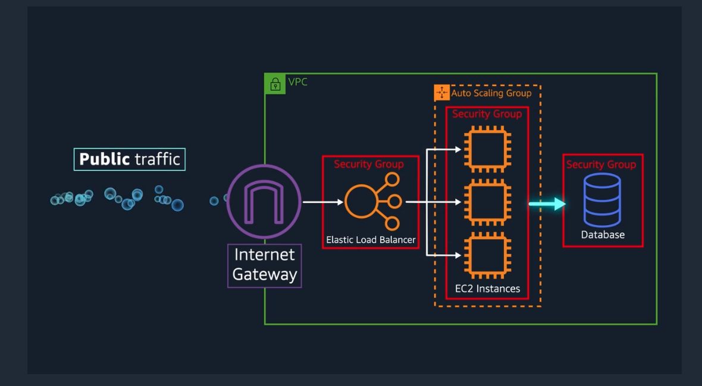

### Virtual Private Gateway

```
💡 Creates a VPN connection between the VPC and the internal corporate network.
```

- To access private resources in a VPC, you can use a **virtual private gateway**.
- The virtual private gateway is the component that **allows protected internet traffic** to enter into the VPC.
- A virtual private gateway enables you to establish a virtual private network (VPN) connection between your **VPC and a private network**, such as an on-premises data centre or internal corporate network.
- A virtual private gateway allows traffic into the VPC **only if it is coming from an approved network**.
- Susceptible to downtime and high-traffic as even though they are private and they are encrypted, but they still use a regular internet connection that has bandwidth that is being shared by many people using the internet.

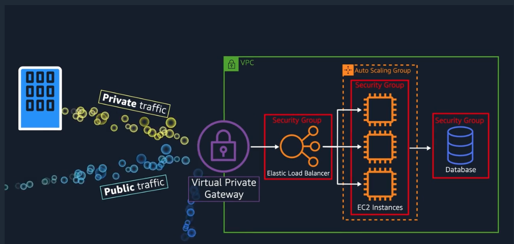

### AWS Direct Connect

```
💡 The point being is you still want a private connection, but you want it to be dedicated and shared with no one else. You want the lowest amount of latency possible with the highest amount of security possible.
```

- Direct Connect allows you to establish a **completely private, dedicated fiber connection from your data centre to AWS**.
- You work with a Direct Connect partner in your area to establish this connection, AWS Direct Connect provides a physical line that connects your network to your AWS VPC.
- This can help you meet **high regulatory and compliance needs**, as well as sidestep any potential bandwidth issues.
- The private connection that AWS Direct Connect provides helps you to **reduce network costs and increase the amount of bandwidth** that can travel through your network.

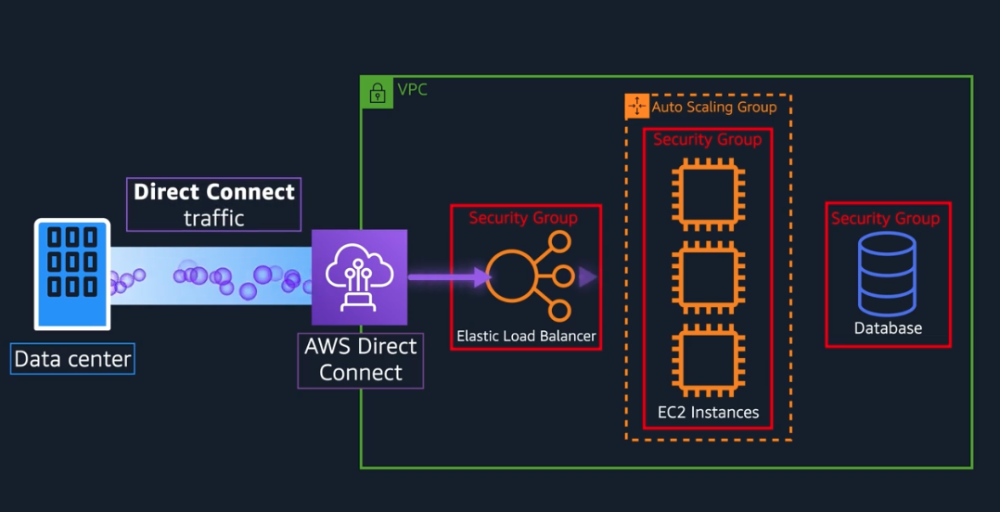

- **Note**: It's also important to note that **one VPC might have multiple types of gateways attached for multiple types of resources all residing in the same VPC**, just in different subnets.

# Subnets and Network Access control List (NACL)

```
💡 A subnet is a section of a VPC in which you can **group resources based on security or operational needs. Subnets can be public or private.
```

- **Public subnets** contain resources that need to be accessible by the public, such as an online store’s website.
- **Private subnets** contain resources that should be **accessible only through your private network**, such as a database that contains customers’ personal information and order histories.
- **In a VPC, subnets can communicate with each other**. For example →
    - you might have an application that involves Amazon EC2 instances in a public subnet communicating with databases that are located in a private subnet.


- When a customer requests data from an application hosted in the AWS Cloud, this request is sent as a packet.
- **A packet is a unit of data sent over the internet or a network.**
- It enters into a VPC through an internet gateway.
- Before a packet can enter into a subnet or exit from a subnet, it checks for permissions.
- These permissions indicate who sent the packet and how the packet is trying to communicate with the resources in a subnet.
- **The VPC component that checks packet permissions for subnets is a Network Access Control List (Network ACL)**

## Network ACL → At subnet level

```
💡 A network ACL is a virtual firewall that controls inbound and outbound traffic at the subnet level.
```

- Each AWS account includes a default network ACL.
- When configuring VPC, you can use your **account’s default network ACL** or **create custom network ACLs**.
- By default, **account’s default network ACL allows all inbound and outbound traffic**, but you can modify it by adding your own rules.
- For custom network ACLs, **all inbound and outbound traffic is denied until you add rules to specify which traffic to allow**.
- Additionally, **all network ACLs have an explicit deny rule**. This rule ensures that if a packet doesn’t match any of the other rules on the list, the packet is denied.
- NACL checks inbound and outbound traffic.


### Stateless Packet Filtering

- Network ACLs perform **stateless** packet filtering. They **remember nothing and check packets that cross the subnet border each way: inbound and outbound.**
- When a packet response for that request comes back to the subnet, **the network ACL does not remember your previous request**.
- The network ACL checks the packet response against its list of rules to determine whether to allow or deny.

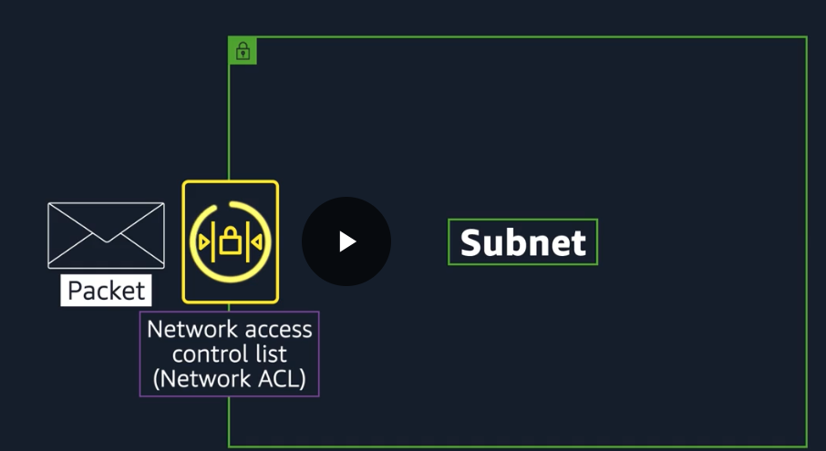

## Security Groups → At EC2 level

```
💡 A security group is a virtual firewall that controls inbound and outbound traffic for an Amazon EC2 instance.
```

- By default, a security group **denies all inbound traffic and allows all outbound traffic**.
- You can add **custom rules to configure which traffic should be allowed**; any other traffic would then be denied.

### Stateful Packet Filtering

- Security groups perform **stateful** packet filtering. They **remember previous decisions** made for incoming packets.
- When a packet response for that request returns to the instance, **the security group remembers your previous request**.
- The security group allows the response to proceed, regardless of inbound security group rules.

### Round Trip from One Instance to Another

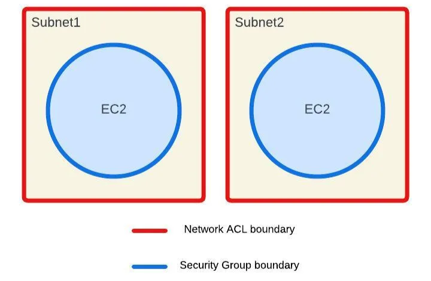

- Let's start with instance A. We wanna send a packet from instance A to instance B in a different subnet, same VPC.
- So instance A sends the packet. Now, the first thing that happens is that packet meets the boundary of the security group of instance A. By default, all outbound traffic is allowed from a security group. The packet made it past the security group of instance A.
- Now it has to leave the subnet boundary. The network ACL doesn't care about what the security group allowed. It has its own list of who can pass and who can't. If the target address is allowed, you can keep going on your journey, which it is.
- So now we have exited the original subnet and now the packet goes to the target subnet where instance B lives.
- If packet is on the approved list for this subnet, it's allowed to enter through the network ACL into the subnet.
- Now, we're approaching the target instance, instance B. Every EC2 Instance has their own security group. You wanna enter this instance, the security group will need to check to see if you're allowed in, and we're on the list. The packet has reached the target instance.
- Once the transaction's complete, lets look at the return traffic pattern.
- It's the most interesting, because this is where the stateful versus stateless nature of the different engines come into play. Because the packet still has to be evaluated at each checkpoint.
- Security groups, by default, allow all return traffic. So they don't have to check a list to see if they're allowed out. Instead, they automatically allow the return traffic to pass by no matter what.
- Network ACL at the subnet boundary do not remember state. They don't care that the packet came in here.
- It might be on a you-can't-leave list. Every ingress and egress is checked with the appropriate list.
- The package return address has to be on their approved list to make it across the border. Made it to the border of the origin subnet, but we have to negotiate passport network ACL control here as well. Stateless controls, means it always checks its list.
- The packet pass the network ACL, the subnet level, which means the packets now made it back to instance A but the security group, is still in charge here.
- The key difference though is these security groups are stateful. The security group recognizes the packet from before. So it doesn't need to check to see if it's allowed in.
- **What about all the network overhead this might generate ? The reality is all of these exchanges happen instantly as part of how AWS Networking actually works.**
- **Good network security will take advantage of both network ACLs and security groups, because security in-depth is critical for modern architectures.**

# Global Networking

## Domain Name System (dns)

```
💡 The phonebook of the internet.
```

It translates human-readable domain names (like `www.example.com`) into IP addresses (like `192.0.2.1`) that computers use to identify each other on the network.

### Key components:

- **Domain names**: Easy-to-remember addresses for websites.
- **IP addresses**: Numeric addresses that computers use to locate each other.
- **DNS servers**: Specialized servers that store domain-to-IP mappings and respond to queries from users or applications.

When you type a URL into your browser, DNS works behind the scenes to look up the corresponding IP address, so your device can connect to the right server and load the website. Without DNS, we'd need to remember numerical IP addresses to visit websites!

For example, suppose that you want to visit AnyCompany’s website.

1. When you enter the domain name into your browser, this request is sent to a customer DNS resolver. 
2. The customer DNS resolver asks the company’s DNS server for the IP address that corresponds to AnyCompany’s website.
3. The company DNS server responds by providing the IP address for AnyCompany’s website, 192.0.2.0.


## Amazon Route 53

- Rout 53 is a DNS web service.
- It gives developers and businesses a reliable way **to route end users to internet applications hosted in AWS**.
- Amazon Route 53 **connects user requests to infrastructure running in AW**S (such as Amazon EC2 instances and load balancers). It can route users to infrastructure outside of AWS.
- Another feature of Route 53 is the ability **to manage the DNS records for domain names.**
- You can **register new domain names** directly in Route 53.
- You can also **transfer DNS records for existing domain names** managed by other domain registrars. This enables you to manage all of your domain names within a single location.

**The following example describes how Route 53 and Amazon CloudFront work together to deliver content to customers.**

Suppose that AnyCompany’s application is running on several Amazon EC2 instances. These instances are in an Auto Scaling group that attaches to an Application Load Balancer. 

1. A customer requests data from the application by going to AnyCompany’s website.
2. Amazon Route 53 uses DNS resolution to identify AnyCompany’s corresponding IP address, 192.0.2.0. This information is sent back to the customer.
3. Customer’s device has the IP to connect to the LB via CloudFront.
4. The customer’s request is sent to the nearest edge location through Amazon CloudFront.
5. Amazon CloudFront connects to the Application Load Balancer, which sends the incoming packet to an Amazon EC2 instance.


# Storage and Databases

# Objectives

- Summarize the basic concept of storage and databases.
- Describe the benefits of Amazon Elastic Block Store (Amazon EBS).
- Describe the benefits of Amazon Simple Storage Service (Amazon S3).
- Describe the benefits of Amazon Elastic File System (Amazon EFS).
- Summarize various storage solutions.
- Describe the benefits of Amazon Relational Database Service (Amazon RDS).
- Describe the benefits of Amazon DynamoDB.
- Summarize various database services.

## Instance Stores

```
💡 Block-level storage volumes behave like physical hard drives.
```

- An instance store provides temporary block-level storage for an Amazon EC2 instance.
- An instance store is **disk storage that is physically attached to the host computer for an EC2 instance**, and therefore **has the same lifespan as the instance**.
- Instance store is **ideal for temporary storage of information that changes frequently**, such as buffers, caches, scratch data, and other temporary content. It can also be used to store temporary data that you replicate across a fleet of instances, such as a load-balanced pool of web servers.
- When the instance is **terminated, you lose any data** in the instance store.

**An Amazon EC2 instance with an attached instance store is running.**


**The instance is stopped or terminated.**


All data on the attached instance store is deleted.


- Amazon EC2 instances are virtual servers.
- If you start an instance from a stopped state, the instance **might start on another host**, where the previously used instance store volume does not exist.
- Therefore, AWS recommends instance stores for use cases that involve temporary data that you do not need in the long term.

### Amazon Elastic Block Store(EBS)

- Service that provides **block-level storage volumes that one can use with EC2 instances**. It **separates drives from the host computer of an EC2 instance.**
- If you **stop or terminate** an Amazon EC2 instance, all the **data on the attached EBS volume remains available**.
- To create an EBS volume, **you define the configuration (such as volume size and type) and provision it**. After you create an EBS volume, it can attach to an Amazon EC2 instance.
- Because EBS volumes are for data that needs to persist, **it’s important to back up the data**.
- You can take **incremental backups of EBS volumes** by creating Amazon **EBS snapshots**.

### EBS Snapshots

```
💡 Incremental backup of EBS Volume
```

- This means that the first backup taken of a volume copies all the data.
- For subsequent backups, only the blocks of data that have changed since the most recent snapshot are saved.
- Full backup →
    - Incremental backups are different from full backups, in which **all the data in a storage volume copies each time a backup occurs**.
    - The full backup includes **data that has not changed since the most recent backup**.
        
        
        

## Object Storage

- In **object storage**, each object consists of data, metadata, and a key.
- Data → might be an **image, video, text document, or any other type of file**.
- Metadata → contains information about **what the data is, how it is used, the object size**, and so on.
- Key → An object’s key is its **unique identifier**.


```
💡 When you modify a file in block storage, only the pieces that are changed are updated. When a file in object storage is modified, the entire object is updated.**
```

## Amazon Simple Storage Service (S3)

```
💡 Service that provides object-level storage. Amazon S3 stores data as objects in buckets.
```

- **Store data as objects. Store objects in buckets.**
- You can upload any type of file to Amazon S3, such as images, videos, text files, and so on.
- For example, you might use Amazon S3 **to store backup files, media files for a website, or archived documents**.
- Amazon S3 offers **virtually unlimited storage space**.
- **The maximum file size for an object in Amazon S3 is 5 TB.**
- When you upload a file to Amazon S3, **you can set permissions to control visibility and access to it**.
- You can also use the Amazon S3 **versioning feature to track changes to your objects over time**, basically keep a file trail.
- You can also create multiple buckets.

### S3 storage classes Types

When selecting an Amazon S3 storage class, consider these two factors:

- How often you plan to retrieve your data
- How available you need your data to be

**Types are as follows** - 

- S3 Standard
- S3 Standard - Infrequent Access (S3 Standard-IA)
- S3 One Zone-Infrequent Access (S3 One Zone-IA)
- S3 Intelligent-Tiering
- S3 Glacier Instant Retrieval
- S3 Glacier Flexible Retrieval
- S3 Glacier Deep Archive
- S3 Outposts

      **S3 Standard →**

---

- Designed for **frequently accessed data**
- Stores data in a **minimum of three** Availability Zones, meaning AWS can sustain the concurrent loss of data in two separate storage facilities. So multiple copies reside across locations
- Amazon S3 Standard provides **high availability for objects**. This makes it a good choice for a wide range of use cases, such as websites, content distribution, and data analytics.
- Amazon S3 Standard has a **higher cost than other storage classes intended for infrequently accessed data and archival storage**.
- Comes with 11 nines of durability, meaning objects stored in S3 standard has a 99.999999999% probability that it will remain intact after a period of 1 year.
- Another useful way to use Amazon S3 is static website hosting, where a static website is a collection of HTML files and each file is akin to a physical page of the actual site. You can do this by simply uploading all your HTML, static web assets, and so forth into a bucket and then checking a box to host it as a static website. You can then enter the bucket's URL and bam! Instant website.

**S3 Standard - Infrequent Access (S3 Standard-IA) →**

---

- Ideal for **infrequently accessed data**
- Similar to Amazon S3 Standard but has a **lower storage price and higher retrieval price**
- Amazon S3 Standard-IA is **ideal for data infrequently accessed but requires high availability when needed**.
- Both Amazon S3 Standard and Amazon S3 Standard-IA store data in a **minimum of three** Availability Zones.
- Amazon S3 Standard-IA provides the **same level of availability as Amazon S3 Standard but with a lower storage price and a higher retrieval price**.

**S3 One Zone-Infrequent Access (S3 One Zone-IA) →**

---

- Stores data in a **single** Availability Zone
- **Has a lower storage price than Amazon S3 Standard-IA**
- Compared to S3 Standard and S3 Standard-IA, which store data in a minimum of three Availability Zones, S3 One Zone-IA stores data in a single Availability Zone.
- This makes it a good storage class to consider if the following conditions apply:
    - You want to save costs on storage.
    - You can easily reproduce your data in the event of an Availability Zone failure.

**S3 Intelligent-Tiering →**

---

- **Ideal for data with unknown or changing access patterns**
- Requires a small monthly monitoring and automation fee per object
- In the S3 Intelligent-Tiering storage class, **Amazon S3 monitors objects’ access patterns**.
- **If you haven’t accessed an object for 30 consecutive days, Amazon S3 automatically moves it to the infrequent access tier, S3 Standard-IA.**
- If you access an object in the infrequent access tier, Amazon S3 automatically moves it to the frequent access tier, S3 Standard.

**S3 Glacier Instant Retrieval →**

---

- **Works well for archived data that requires immediate access**
- Can retrieve objects within a **few milliseconds**
- When you decide between the options for archival storage, **consider how quickly you must retrieve the archived objects**.
- You can retrieve objects stored in the S3 Glacier Instant Retrieval storage class within **milliseconds**, with the same performance as S3 Standard.

**S3 Glacier Flexible Retrieval →**

---

- **Low-cost storage designed for data archiving**
- Able to retrieve objects within a **few minutes to hours**
- S3 Glacier Flexible Retrieval is a low-cost storage class that is ideal for data archiving. For example, you might use this storage class to store archived customer records or older photos and video files.
- You can retrieve your data from S3 Glacier Flexible Retrieval **from 1 minute to 12 hours**.
- **WORM (Write Once/ Read Many) →**
    - And if you have compliance requirements around retaining data for, say, a certain period of time, you can employ an S3 Glacier vault lock policy and lock your vault.
    - You can specify controls such as write once, read many, or WORM, in a vault lock policy and lock the policy from future edits.

**S3 Glacier Deep Archive →**

---

- Lowest-cost object storage class ideal for **archiving**
- Able to retrieve objects within **12 hours**
- S3 Deep Archive supports **long-term retention and digital preservation for data that might be accessed once or twice in a year**.
- This storage class is the **lowest-cost storage in the AWS Cloud, with data retrieval from 12 to 48 hours**.
- All objects from this storage class are **replicated and stored across at least three geographically dispersed Availability Zones**.
- Employs WORM

**S3 Outposts →**

---

- Creates S3 buckets on Amazon S3 Outposts
- Makes it easier to retrieve, store, and access data on AWS Outposts
- Amazon S3 Outposts **delivers object storage to your on-premises AWS Outposts environment**.
- Amazon S3 Outposts is designed **to store data durably and redundantly across multiple devices and servers** on your Outposts.
- It works well for **workloads with local data residency requirements** that must satisfy demanding performance needs by keeping data close to on-premises applications.

## EBS vs S3

| **Amazon EBS** | **Amazon S3** |
| --- | --- |
| Block storage breaks files down to small component parts or blocks. Updating a file in block storage will update the blocks where those bits live and not all blocks. | Object storage treats any file as a complete, discreet object, this means but every time there's a change to the object, entire object needs to be uploaded to the S3. There are no delta updates. |
| Sizes up to 16 TiB | Unlimited Storage |
| Survive termination of their EC2 Instance | Individual objects upto 5 TBs |
| Solid state by default | WORM - Write Once/ Read Many |
| HDD Options | 99.999999999% durability |
| Ideal for complex read, write, change functions | Ideal for complete objects or only occasional changes |
| Use-case → 80-gigabyte video file that you're making edit corrections on. For that 80-gigabyte file, when you make an edit to one scene in the film and save that change, the engine only updates the blocks where those bits live. If you're making a bunch of micro edits, using EBS, elastic block storage, is the perfect use case. If you were using S3, every time you saved the changes, the system would have to upload all 80 gigabytes, the whole thing, every time.  | Use-case → a photo analysis website where users upload a photo of themselves, and your application finds the animals that look just like them. You have potentially millions of animal pictures that all need to be indexed and possibly viewed by thousands of people at once. This is the perfect use case for S3. S3 is already web enabled. Every object already has a URL that you can control access rights to who can see or manage the image. It's regionally distributed, which means that it has 11 nines of durability, so no need to worry about backup strategies. S3 is your backup strategy. Plus the cost savings is substantial overrunning the same storage load on EBS. With the additional advantage of being serverless, no Amazon EC2 instances are needed. |

## File Storage

- In **file storage**, multiple clients (such as users, applications, servers, and so on) can access data that is stored in shared file folders.
- In this approach, **a storage server uses block storage with a local file system to organize files.**
- Clients access data through file paths.
- **Compared to block storage and object storage, file storage is ideal for use cases in which a large number of services and resources need to access the same data at the same time.**

## Amazon Elastic File System (EFS)

- **EFS is a managed file system.**
- It is a scalable file system used with **AWS Cloud services and on-premises resources**.
- With EFS, you can keep existing file systems in place but let AWS do all the heavy lifting of the scaling and the replication.
- EFS allows you to have **multiple instances accessing the data in EFS at the same time**.
- As you add and remove files, Amazon EFS **grows and shrinks automatically**. It can scale on demand to petabytes without disrupting applications.
- It **scales up and down as needed** without you needing to do anything to make that scaling happen.
- **Use-case → shared file systems across their applications.**
    - you might have multiple servers running analytics on large amounts of data being stored in a shared file system. This data traditionally has been hosted on premises.
    - In this on-premises data center, you would have to ensure that the storage you have can keep up with the amount of data that you are storing.
    - Make sure backups are taken, and that the data is stored redundantly as well as manage all of the servers hosting that data.

| Amazon EBS | Amazon EFS |
| --- | --- |
| Volumes attach to EC2 Instances | Multiple Instances reading and writing from it at the same time |
| Availability Zone-level resource | Region resource, stores data in and across multiple AZs |
| Need to be in the same AZ to attach EC2 to EBS | Any EC2 instance in the region can write to EFS. |
| Volumes do not automatically scale | Automatically scales as you write more data |
| Save files on it, run DB on top of it or store applications on it. Its a hard drive.  | True file system for Linux |

## Amazon Relational DB

### Relational DB

- In a **relational database**, data is stored in a way that relates it to other pieces of data.
- Relational databases use **structured query language (SQL)** to store and query data.
- This approach allows data to be stored in an **easily understandable, consistent, and scalable** way.
- For example, the coffee shop owners can write a SQL query to identify all the customers whose most frequently purchased drink is a medium latte.

### **Amazon Relational Database Service**

- RDS is a service that enables you **to run relational databases in the AWS Cloud**.
- Amazon RDS is a managed service that **automates tasks such as hardware provisioning, database setup, patching, and backups**.
- One can integrate Amazon RDS with other services to fulfill your business and operational needs, such as **using AWS Lambda to query your database from a serverless application.**
- Amazon RDS provides a number of different security options. Many Amazon RDS database engines offer **encryption at rest (protecting data while it is stored) and encryption in transit (protecting data while it is being sent and received).**

### Amazon RDS Database Engines

Amazon RDS is available on six database engines, which optimize for memory, performance, or input/output (I/O). Supported database engines include:

- Amazon Aurora
- PostgreSQL
- MySQL
- MariaDB
- Oracle Database
- Microsoft SQL Server

### **Amazon Aurora**

- It is an enterprise-class relational database.
- It is compatible with MySQL and PostgreSQL relational databases.
- It is up to **five times faster than standard MySQL databases** and **up to three times faster than standard PostgreSQL** databases.
- Amazon Aurora helps to **reduce your database costs by reducing unnecessary input/output (I/O) operations**, while ensuring that your database resources remain reliable and available.
- Consider Amazon Aurora **if your workloads require high availability. It replicates six copies of your data across three Availability Zones and continuously backs up your data to Amazon S3.**

## Amazon Non-Relational DB

### Non-Relational DB

- In a **nonrelational database**, you create tables. A table is a place where you can store and query data.
- Non-relational databases are sometimes referred to as “NoSQL databases” because they use structures other than rows and columns to organize data.
- One type of structural approach for non-relational databases is **key-value pairs**.
- **With key-value pairs, data is organized into items (keys), and items have attributes (values). You can think of attributes as being different features of your data.**
- In a key-value database, you **can add or remove attributes from items in the table at any time**.
- Additionally, **not every item in the table has to have the same attributes.**

### Amazon Dynamo DB

- It is a **key-value database service**. It delivers **single-digit millisecond performance at any scale**.
- **Serverless** →
    - you do not have to provision, patch, or manage servers.
    - you also do not have to install, maintain, or operate software.
- **Automatic Scaling →**
    - As the size of your database shrinks or grows, DynamoDB **automatically scales to adjust for changes in capacity** while maintaining consistent performance.
    - This makes it a **suitable choice for use cases that require high performance while scaling**.

## Relational Vs Non-Relational DB

| Amazon RDS | Amazon Dynamo DB |
| --- | --- |
| to remove undifferentiated heavy lifting from your DB administrators | Uses key-value pair that requires no advanced schema, able to operate as a global database at the touch of a button |
| Automatic high availability and recovery periods | Massive throughput |
| Customers control the data, schema and network | Petabyte scale potential |
|  | Granular API access |
| **Use-case** → you have a sales supply chain management system that you have to analyze for weak spots. Using RDS is the clear winner here because it's built for business analytics, because you need complex relational joins. | **Use-case** →  imagine you have an employee contact list: names, phone numbers, emails, employee IDs. Well, this is all single table territory. I could use a relational database for this, but the things that make relational databases great, all of that complex functionality, creates overhead and lag and expense if you're not actually using it. By eliminating all the overhead, DynamoDB allows you to build powerful, incredibly fast databases where you don't need complex joint functionality. |

```
💡 Each service is the right service for specific needs
```

## Data-warehousing with Amazon Redshift

### Problem →

- Data analysis is the realm of a whole different class of databases.
- In order to handle the velocity of real time read/write functionality, most relational databases tend to function fabulously at certain capacities. How much content it actually stores.
- The problem with historical analytics, data that answers questions like, "Show me how production has improved since we started", is the data collection never stops.
- In fact, with modern telemetry and the explosion of IoT, the volume of data will overwhelm even the beefiest traditional relational database.
- It gets worse. Not just the volume, but the variety of data can be a problem.
    - You want to run business intelligence or BI projects against data coming from different data stores like your inventory, your financial, and your retail sales systems? A single query against multiple databases sounds nice, but traditional databases don't handle them easily.
- Once **data becomes too complex to handle with traditional relational databases, you've entered the world of data warehouses**.
- Data warehouses are engineered specifically for this **kind of big data**, where you are **looking at historical analytics** as opposed to operational analysis.
- Historical may be as soon as: show me last hour's sales numbers across all the stores. The key thing is, the data is now set. We're not selling any more from the last hour because that is now in the past.
- Compare that question to, "How many bags of coffee do we still have in our inventory right now?" Which could be changing as we speak.
- **As long as your business question is looking backwards at all, then a data warehouse is the right solution for that line of business intelligence.**

### Amazon Redshift →

- It is a **data warehousing as a service. It's massively scalable.**
- Redshift nodes in multiple petabyte sizes is very common.
- In fact, in cooperation with Amazon Redshift Spectrum, **you can directly run a single SQL query against exabytes of unstructured data running in data lakes.**
- But it's more than just being able to handle massively larger data sets. Redshift uses a variety of innovations that allow you **to achieve up to 10 times higher performance than traditional databases, when it comes to these kinds of business intelligence workloads.**
- **The key to understand that when you need big data BI solutions, Redshift allows you to get started with a single API call**. Less time waiting for results, more time getting answers.

## AWS Database Migration Service or Amazon DMS

```
💡 DMS helps to migrate existing databases onto AWS in a secure and easy fashion.
```

- Migration happens between a source and a target database.
- The best part is that the source database remains fully operational during the migration, minimizing downtime to applications that rely on that database.
- Better yet is that the source and target databases don't have to be of the same type.
- Also, downtime is minimized for applications that rely on that database.

### Homogenous Databases

- **Source and target DBs are of same type**, can be from -
    - MySQL → Amazon RDS for MySQL
    - Microsoft SQL Server → Amazon RDS for SQL Server
    - Oracle → Amazon RDS for Oracle
- The process is fairly straightforward since **schema structures, data types, and database code is compatible between source and target**.

- Source DB can be located -
    - On-premises
    - running on Amazon EC2 instances
    - can be Amazon RDS DB
- Target can be a DB in -
    - Amazon EC2
    - Amazon RDS
    

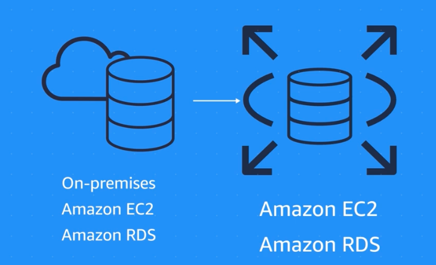

### Heterogenous Databases

- Source and target DBs are of different types.
- 2 Step process using AWS Schema Conversion Tool →
    - Since the schema structures, data types, and database code are different between source and target, we first need to convert them using the AWS Schema Conversion Tool.
    - **This will convert the source schema and code to match that of the target database.**

### Other use cases

**Development and test database migrations →**

- To develop and test against production data, but without affecting production users.
- In this case, you use DMS to migrate a copy of your production database to your dev or test environments, either once-off or continuously.

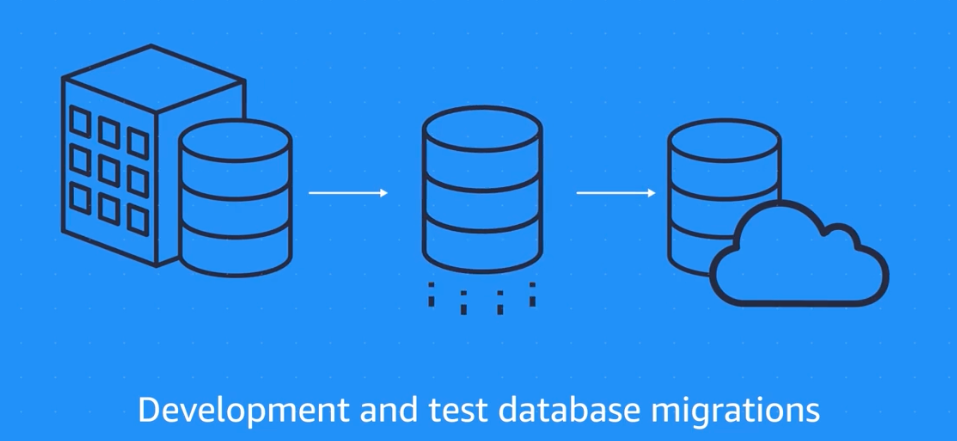

**Database Consolidation →**

**Continuous Database Replication →**

- Combining several databases into a single database

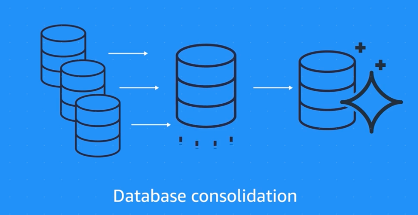

- Sending ongoing copies of your data to other target sources instead of doing a one-time migration.
- This could be for disaster recovery or because of geographic separation.
    
    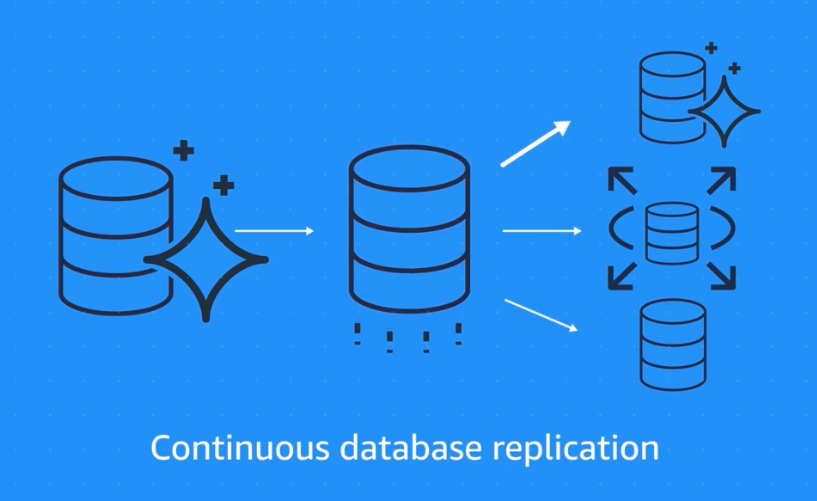
    

## Additional Database Services

### **Amazon DocumentDB**

It is a document database service that **supports MongoDB workloads**. (MongoDB is a document database program.)

### **Amazon Neptune**

- It is a graph database service.
- You can use Amazon Neptune to build and run applications that work with highly connected datasets, such as recommendation engines, fraud detection, and knowledge graphs.

### **Amazon Quantum Ledger Database (Amazon QLDB)**

- It is a ledger database service.
- You can use Amazon QLDB to review **a complete history of all the changes that have been made to your application data.**

### **Amazon Managed Blockchain**

- It is a service that you can use **to create and manage blockchain networks** with open-source frameworks.
    - Blockchain is a distributed ledger system that lets multiple parties run transactions and share data without a central authority.

### **Amazon ElastiCache**

- It is a service that **adds caching layers on top of your databases to help improve the read times of common requests**
- It supports **two types of data stores: Redis and Memcached.**

### **Amazon DynamoDB Accelerator**

- It is an in-memory cache for DynamoDB.
- It helps **improve response times from single-digit milliseconds to microseconds**.

# Security

# **Objectives**

In this module, you will learn how to:

- Explain the benefits of the shared responsibility model.
- Describe multi-factor authentication (MFA).
- Differentiate between the AWS Identity and Access Management (IAM) security levels.
- Explain the main benefits of AWS Organizations.
- Describe security policies at a basic level.
- Summarize the benefits of compliance with AWS.
- Explain additional AWS security services at a basic level.

## AWS Shared Responsibility Model

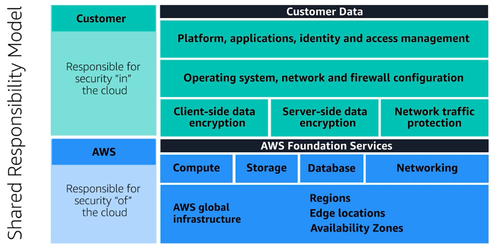

- Both customer and AWS is responsible for keeping AWS resources secure.
    - Reason being you **do not treat your AWS environment as a single object**.
    - Rather, **you treat the environment as a collection of parts that build upon each other**.
    - AWS is responsible for some parts of your environment and you (the customer) are responsible for other parts. This concept is known as the shared responsibility model ([link](https://aws.amazon.com/compliance/shared-responsibility-model/))
- Security and Compliance is a shared responsibility between AWS and the customer.
- This shared model can **help relieve the customer’s operational burden** as **AWS operates, manages and controls the components from the host operating system and virtualization layer down to the physical security of the facilities in which the service operates**.
- The **customer assumes responsibility and management of the guest operating system** (including updates and security patches), other associated application software as well as the configuration of the AWS provided security group firewall.
- **AWS Responsibility “Security of the Cloud”** →
    - AWS is responsible for **protecting the infrastructure that runs all of the services offered in the AWS Cloud**.
    - This infrastructure is composed of the hardware, software, networking, and facilities that run AWS Cloud services.
- **Customer Responsibility “Security in the cloud”** →
    - Customer responsibility will be **determined by the AWS Cloud services that a customer selects**.
    - This determines the **amount of configuration work the customer must perform as part of their security responsibilities**.
- Example of EC2 →
    - **AWS (Security of the Cloud)** → Service such as Amazon Elastic Compute Cloud (Amazon EC2) is categorized as Infrastructure as a Service (IaaS) and, as such, **requires the customer to perform all of the necessary security configuration and management tasks**.
    - **Customers (Security in the Cloud)** → Customers that deploy an Amazon EC2 instance are responsible for **management of the guest operating system** (including **updates and security patches**), any **application software or utilities installed by the customer on the instances**, and **the configuration of the AWS-provided firewall** (called a **security group**) on each instance.
- Example for Abstracted Services(such as Amazon S3 and Amazon DynamoDB ) →
    - **AWS operates →** the infrastructure layer, the operating system, and platforms
    - **customers access** the endpoints to store and retrieve data.
        - Customers are responsible for **managing their data** (including encryption options), classifying their assets, and using IAM tools to apply the appropriate permissions.

### Customers: Security in the cloud

- Customers are responsible for the **security of everything that they create and put *in* the AWS Cloud.**
- When using AWS services, the customer, **maintain complete control over your content**.

```
💡 You are responsible for **managing security requirements for your content, including which content you choose to store on AWS, which AWS services you use, and who has access to that content. You also control how access rights are granted, managed, and revoked.
```

- The security steps that you take will depend on factors such as the **services that you use, the complexity of your systems, and your company’s specific operational and security needs**.
- Steps include **selecting, configuring, and patching the operating systems that will run on Amazon EC2 instances, configuring security groups, and managing user accounts**.

### AWS: Security of the cloud

- AWS is responsible for security *of* the cloud.
- AWS **operates, manages, and controls the components at all layers of infrastructure**. This includes areas such as the **host operating system, the virtualization layer, and even the physical security of the data centers** from which services operate.
- AWS is responsible for **protecting the global infrastructure that runs all of the services offered in the AWS Cloud**. This infrastructure includes AWS Regions, Availability Zones, and edge locations.
- AWS manages the security of the cloud, specifically the physical infrastructure that hosts your resources, which include:
    - Physical security of data centers
    - Hardware and software infrastructure
    - Network infrastructure
    - Virtualization infrastructure

## AWS Identity and Access Management (IAM)

```
💡 Enabled to manage access to AWS services and resources securely

</aside>

- Provides flexibility to configure access based on your company’s specific operational and security needs.
- This can be done by using a combination of IAM features -
    - IAM users, groups and roles
    - IAM policies
    - Multi- Factor Authentication (MFA)

### AWS Account Root User

- When you first create an AWS account, you begin with an identity known as the root user.
- The root user is accessed by **signing in with the email address and password that you used to create your AWS account.**
- It has **complete access to all the AWS services and resources** in the account.

```
💡 Best Practise:

- Do **not** use the root user for everyday tasks.
- Instead, use the root user to create your first IAM user and assign it permissions to create other users.
- Then, continue to create other IAM users, and access those identities for performing regular tasks throughout AWS.
- **Only use the root user when you need to perform a limited number of tasks** that are only available to the root user.
- Examples of these tasks include changing your root user email address and changing your AWS support plan.
```

### IAM Users

- An **IAM user** is **an identity that you create in AWS**.
- It represents the person or application that **interacts with AWS services and resources**.
    - It consists of a name and credentials.
- **By default**, when you create a new IAM user in AWS, **it has no permissions associated with it**.
- To allow the IAM user to perform specific actions in AWS, such as launching an Amazon EC2 instance or creating an Amazon S3 bucket, **you must grant the IAM user the necessary permissions**.


```
💡 Best practice:

We recommend that you **create individual IAM users for each person who needs to access AWS**.

Even if you have multiple employees who require the same level of access, you should create individual IAM users for each of them. **This provides additional security by allowing each IAM user to have a unique set of security credentials.**

```

### IAM Policy

- JSON Document that allows or denies permissions to AWS Services and resources
- Enables to customer user’s levels of access to resources.
- Example → Allow users to access all of the S3 bucket within account or only specific bucket.

```
💡

**Best practice:**

Follow the security principle of **least privilege** when granting permissions.

By following this principle, you help **to prevent users or roles from having more permissions than needed to perform their tasks.**

For example, if an employee needs access to only a specific bucket, specify the bucket in the IAM policy. Do this instead of granting the employee access to all of the buckets in your AWS account.

```

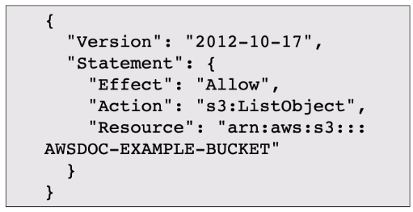

*This example IAM policy allows permission to access the objects in the Amazon S3 bucket with ID: AWSDOC-EXAMPLE-BUCKET.*

The IAM policy is **allowing** an action of ”**returning some or all of objects in a bucket” using operation Amazon *S3: ListObject*** for **bucket ID AWSDOC-EXAMPLE-BUCKET**

### IAM Groups

```
💡

**Collection of IAM Users**

```

- When you assign an IAM policy to a group, all users in the group are granted permissions specified by the policy.


### IAM Roles

```
💡

An IAM role is an identity **that you can assume to gain temporary access to permissions**.

```

- Before an IAM user, application, or service **can assume an IAM role, they must be granted permissions to switch to the role**.
- When someone assumes an IAM role, **they abandon all previous permissions that they had under a previous role and assume the permissions of the new role**.

```
💡

**Best practice:**

IAM roles are idea**l for situations in which access to services or resources needs to be granted temporarily**, instead of long-term.

</aside>

### Multi Factor Authentication

```
💡

In IAM, multi-factor authentication (MFA) **provides an extra layer of security** for your AWS account.

</aside>

- After signing to AWS account using email and password, **the user is prompted for an authentication response from their AWS MFA device**.
- This device could be a hardware security key, a hardware device, or an MFA application on a device such as a smartphone.

## AWS Organizations

```
💡

**Central location to manage multiple AWS accounts**

</aside>

- Creating an AWS Organization automatically creates a root, which is the parent container for all the accounts in your organization.
- One can centrally control permissions for the accounts in the organization using Service Control Policies (SCPs).
- **SCPs enable you to place restrictions on the AWS services, resources, and individual API actions that users and roles in each account can access.**

### Organizational Unit (OU)

- In AWS Organizations, you can group accounts into organizational units (OUs) **to make it easier to manage accounts with similar business or security requirements**.
- **When you apply a policy to an OU, all the accounts in the OU automatically inherit the permissions specified in the policy.**
- By organizing separate accounts into OUs, you can **more easily isolate workloads** or applications that have specific security requirements.
- Example →
    - if your company has accounts that can access only the AWS services that meet certain regulatory requirements, you can put these accounts into one OU.
    - Then, you can attach a policy to the OU that blocks access to all other AWS services that do not meet the regulatory requirements.

## Compliance → AWS Artifact

```
💡

> A service that **provides on-demand access to AWS security and compliance reports and select online agreements**
> 
</aside>

AWS Artifact **provides access to AWS security and compliance documents**, such as AWS ISO certifications, Payment Card Industry (PCI) reports, and Service Organization Control (SOC) reports. 

**Two main sections →**

**AWS Artifact Agreements**

- In AWS Artifact Agreements, **you can review, accept, and manage agreements for an individual account and for all your accounts in AWS Organizations**.
- Different types of agreements are offered to address the needs of customers who are subject to specific regulations, such as the Health Insurance Portability and Accountability Act (HIPAA).

**AWS Artifact Reports**

- AWS Artifact Reports provide compliance reports from third-party auditors.
- These auditors have tested and verified that AWS is compliant with a variety of global, regional, and industry-specific security standards and regulations.
- AWS Artifact Reports remains up to date with the latest reports released.
- You can provide the AWS audit artifacts to your auditors or regulators as evidence of AWS security controls.

# Distributed Denial-Of-Service Attacks (DDoS or D-DoS)

## Denial-of-Service Attacks

```
💡

**A deliberate attempt to make a website or application unavailable to users**

</aside>


For example →

- An attacker might **flood a website or application with excessive network traffic** until the targeted website or application becomes **overloaded and is no longer able to respond.**
- If the website or application becomes unavailable, this denies service to users who are trying to make legitimate requests.

## Distributed Denial-of-Service Attacks


- In a distributed denial-of-service (DDoS) attack, **multiple sources are used to start an attack** that aims to make a website or application unavailable.
- This can come **from a group of attackers, or even a single attacker.**
- The single attacker can use **multiple infected computer**s (also known as “bots”) to send excessive traffic to a website or application.

## Types of DDoS Attacks

## UDP Flood

- A **UDP flood** is a type of **Denial of Service (DoS)** attack where an attacker overwhelms a target server with a large number of **User Datagram Protocol (UDP)** packets.
- Since UDP is a connectionless protocol, it doesn't require a handshake process (like TCP does) to establish communication, making it easier for attackers to flood a target with packets.

**Key aspects of a UDP flood:**

- **High Traffic Volume**: The attacker sends a massive number of UDP packets to random ports on the target server.
- **Resource Overload**:
    - The server, upon receiving these packets, tries to process them and send ICMP "Destination Unreachable" messages when no application is listening on those ports.
    - This consumes bandwidth, CPU, and memory resources, potentially causing the server to slow down or crash.
- **No Connection State**: Since UDP doesn't maintain a state (like TCP), it’s difficult to track and filter out malicious traffic.

**Goal of UDP Flood:**

The aim is to exhaust the target’s resources, **rendering it unavailable to legitimate users**, thereby causing a denial of service. 

### AWS Solution for UDP Flood → Security Group

```
💡

**Security group operates at the AWS Network Level, not at the EC2 Instance level.**

Security Groups control traffic **before** it reaches the network interface of an EC2 instance, rather than filtering traffic once it is inside the instance.

</aside>

- **Network-Level Filtering**
    - **Security Groups** are essentially virtual firewalls that operate at the **VPC (Virtual Private Cloud) level**, specifically at the **Elastic Network Interface (ENI)** level of your EC2 instance.
    - The ENI is the network interface that connects your EC2 instance to the VPC. All traffic to and from your instance passes through this interface.
    - **The rules defined in a Security Group control the traffic coming into or going out of the network interface, meaning the traffic is either allowed or blocked before it even touches the operating system of the EC2 instance.**
    - This is different from a host-based firewall that operates inside the instance, where the traffic has already reached the instance and is being filtered by the operating system.
- **Implications of Network-Level Operation**
    - **Pre-Instance Filtering**: Security Groups prevent unwanted traffic from reaching the EC2 instance altogether. If a Security Group rule denies certain traffic, that traffic is stopped at the network level, preventing it from even reaching the instance for processing.
    - **Efficiency**: Because the traffic is filtered at the network interface level, your EC2 instance doesn’t need to handle the processing overhead of filtering network packets. This reduces the load on the instance and allows it to focus on running applications.
    - **Centralized Control**: Since Security Groups are tied to the VPC network, the traffic control is consistent and centralized. You can apply the same Security Group to multiple EC2 instances and network interfaces, ensuring uniform security policies across your infrastructure.
- **Isolation from the EC2 Instance**
    - **Even if an attacker gains access to your EC2 instance, the Security Group will still control traffic at the network level**. This provides an additional layer of protection since the Security Group rules are enforced outside the instance, making it harder for attackers to bypass them.
    - In contrast, if you were using only a host-based firewall (inside the instance), an attacker who compromises the instance could potentially disable or modify the firewall rules.
- **Example:**
    - **Without Security Groups**: If you didn’t have Security Groups, all incoming traffic would reach your EC2 instance, and you would need to rely on a software firewall inside the instance (like `iptables` on Linux or Windows Firewall) to filter out unwanted traffic. This consumes instance resources and creates potential security risks if the instance’s firewall is misconfigured or compromised.
    - **With Security Groups**: Unwanted traffic is blocked at the network interface level, and only the allowed traffic reaches the EC2 instance, reducing the risk and offloading that burden from the instance.

### HTTP Level Attack

- An **HTTP-level attack** targets the application layer (Layer 7) of the OSI model, specifically the web server and its HTTP protocol.
- Instead of overwhelming a server with large volumes of traffic (like network-based attacks), HTTP-level attacks exploit vulnerabilities in the way web servers process HTTP requests.
- Types of HTTP-Level Attacks:
    1. **HTTP Flood**: The attacker sends a large number of legitimate HTTP requests (GET or POST) to overload the server, often making it difficult to distinguish between legitimate and malicious traffic. This consumes server resources, slowing down or crashing the server.
    2. **Slow HTTP Requests**: The attacker sends partial or incomplete HTTP requests, forcing the server to keep connections open and exhaust resources (e.g., Slowloris attack).

**Slowloris Attack →**

- The **Slowloris attack** is a type of **HTTP-level attack** designed to exhaust server resources by keeping many connections open for an extended period using minimal bandwidth.
- How Slowloris Works:
    1. The attacker sends a legitimate HTTP request to the target server but only transmits the request headers very slowly, sending partial headers in small chunks.
    2. The server keeps the connection open, waiting for the full HTTP request to be received.
    3. The attacker repeats this with many open connections, but none of them are completed.
    4. Over time, the server's connection pool becomes full, preventing it from accepting new legitimate requests, leading to a denial of service.
- Characteristics:
    - **Low Bandwidth**: Slowloris can cause significant damage with minimal bandwidth usage.
    - **Exploits HTTP Protocol**: By sending incomplete HTTP requests, it keeps the server's connection open indefinitely.

### AWS Solution for Slowloris Attack → ELB and AWS Shield with AWS WAF (Web Application Firewall)

**Elastic Load Balancer →**

```
💡

Because the ELB handles the http traffic request first, so it **waits until the entire message, no matter how fast or slow, is complete before sending** it over to the front end web server.

</aside>

- **Idle Timeouts**: ELB has configurable idle timeout settings, which define how long to keep an open but inactive connection. If a Slowloris attack sends incomplete HTTP requests at a slow pace, ELB will automatically close the connection once the idle timeout period is reached, preventing the attacker from holding the connection open indefinitely.
- This prevents the server from waiting indefinitely for the rest of the request, making Slowloris ineffective.

### AWS Shield

```
💡

AWS Shield is a service that protects applications against DDoS attacks. AWS Shield provides two levels of protection: Standard and Advanced.

</aside>

**AWS Shield Standard**

- **AWS Shield Standard** automatically **protects all AWS customers at no cost**.
- It protects your AWS resources from the most common, frequently occurring types of DDoS attacks.
- As network traffic comes into your applications, **AWS Shield Standard uses a variety of analysis techniques to detect malicious traffic in real time and automatically mitigates it**.

**AWS Shield Advanced**

- **AWS Shield Advanced** is a **paid service that provides detailed attack diagnostics and the ability to detect and mitigate sophisticated DDoS attacks.**
- It also **integrates with other services such as Amazon CloudFront, Amazon Route 53, and Elastic Load Balancing**.
- Additionally, you can integrate AWS Shield with AWS WAF by writing custom rules to mitigate complex DDoS attacks.

## Additional Security Services

### AWS Key Management Service (AWS KMS)

- Application owners must ensure that your applications’ data is secure while in storage **(encryption at rest)** and while it is transmitted, known as **encryption in transit**.
- AWS KMS enables you to perform encryption operations through the use of **cryptographic keys**.
- A cryptographic key is a random string of digits used for locking (encrypting) and unlocking (decrypting) data.
- You can use AWS KMS to create, manage, and use cryptographic keys. You can also control the use of keys across a wide range of services and in your applications.
- With AWS KMS, **you can choose the specific levels of access control that you need for your keys.**
- For example → you can specify which IAM users and roles are able to manage keys.
- Alternatively, you can temporarily disable keys so that they are no longer in use by anyone.
- Keys never leave AWS KMS, and you are always in control of them.

### AWS Web Application Firewall (AWS WAF)

- A web application firewall that **lets you monitor network requests that come into your web applications.**
- **AWS WAF works together with Amazon CloudFront and an Application Load Balancer.**
- AWS WAF works in a way similar to NACL to block or allow traffic.
- However, it does this by using a **web access control list (ACL)** to protect your AWS resources.

- Suppose that your application has been receiving malicious network requests from several IP addresses.
- You want to prevent these requests from continuing to access your application, but you also want to ensure that legitimate users can still access it.
- You configure the web ACL to allow all requests except those from the IP addresses that you have specified.
- When a request comes into AWS WAF, it checks against the list of rules that you have configured in the web ACL.
- If a request does not come from one of the blocked IP addresses, it allows access to the application.
- However, if a request comes from one of the blocked IP addresses that you have specified in the web ACL, AWS WAF denies access.


### Amazon Inspector

- Amazon Inspector helps to improve the security and compliance of applications **by running automated security assessments**.
- It checks applications for security vulnerabilities and deviations from security best practices, such as open access to Amazon EC2 instances and installations of vulnerable software versions.
- After Amazon Inspector has performed an assessment, **it provides you with a list of security findings**.
- The list prioritizes by severity level, including a detailed description of each security issue and a recommendation for how to fix it.
- However, AWS does not guarantee that following the provided recommendations resolves every potential security issue.
- Under the shared responsibility model, customers are responsible for the security of their applications, processes, and tools that run on AWS services.

### Amazon GuardDuty

```
💡

Threat Detection Service

</aside>

- A service that provides intelligent threat detection for your AWS infrastructure and resources.
- **It identifies threats by continuously monitoring the network activity and account behavior within your AWS environment.**


- After you have enabled GuardDuty for your AWS account, GuardDuty begins monitoring your network and account activity.
- You **do not have to deploy or manage any additional security software.**
- GuardDuty then **continuously analyzes data from multiple AWS sources, including VPC Flow Logs and DNS logs**.
- If GuardDuty detects any threats, you can review detailed findings about them from the AWS Management Console. Findings include recommended steps for remediation.
- You can also configure AWS Lambda functions to take remediation steps automatically in response to GuardDuty’s security findings.

# Monitoring and Analytics

## AWS CloudWatch

```
💡

A web service that enables you to monitor and manage various metrics and configure alarm actions based on data from those metrics.

</aside>

- CloudWatch uses **metrics** to represent the data points for your resources.
- AWS services send metrics to CloudWatch.
- CloudWatch then uses these **metrics to create graphs automatically that show how performance has changed over time.**

### **CloudWatch alarms**

- With CloudWatch, you can create **alarms** that automatically perform actions if the value of your metric has gone above or below a predefined threshold.
- For example →
    - suppose that your company’s developers use Amazon EC2 instances for application development or testing purposes.
    - If the developers occasionally forget to stop the instances, the instances will continue to run and incur charges.
    - In this scenario, you could create a CloudWatch alarm that automatically stops an Amazon EC2 instance when the CPU utilization percentage has remained below a certain threshold for a specified period.
    - When configuring the alarm, you can specify to receive a notification whenever this alarm is triggered.

### **CloudWatch dashboard**

**The CloudWatch dashboard feature enables you to access all the metrics for your resources from a single location.** 

For example → 

- you can use a CloudWatch dashboard to monitor the CPU utilization of an Amazon EC2 instance, the total number of requests made to an Amazon S3 bucket, and more.
- You can even customize separate dashboards for different business purposes, applications, or resources.


## AWS CloudTrail

```
💡

**Records API calls for AWS account.**

</aside>

- **The recorded information includes the identity of the API caller, the time of the API call, the source IP address of the API caller, and more.**
- You can think of CloudTrail as a “trail” of breadcrumbs (or a log of actions) that someone has left behind them.
- Recall that you can use API calls to provision, manage, and configure your AWS resources.
- **With CloudTrail, you can view a complete history of user activity and API calls for your applications and resources.**
- Events are typically updated in CloudTrail within 15 minutes after an API call. You can filter events by specifying the time and date that an API call occurred, the user who requested the action, the type of resource that was involved in the API call, and more.
- CloudTrail logs can help answer following question about an action →
    - What happened ?
    - Who made the request ?
    - When did this occur ?
    - How was the request made ?
- **CloudTrail Insights → enables CloudTrail to automatically detect unusual API activities in AWS account.**
- Example →
    - CloudTrail Insights might detect that a higher number of Amazon EC2 instances than usual have recently launched in your account.
    - You can then review the full event details to determine which actions you need to take next.

## AWS Trusted Advisor

```
💡

**A web service that inspects your AWS environment and provides real-time recommendations in accordance with AWS best practices.**

</aside>

- Trusted Advisor compares its findings to AWS best practices in five categories →
    - cost optimization
    - performance
    - security
    - fault tolerance
    - service limits.


- For the checks in each category, Trusted Advisor offers a list of recommended actions and additional resources to learn more about AWS best practices.
- The guidance provided by AWS Trusted Advisor can benefit your company at all stages of deployment.
- For example →
    - you can use AWS Trusted Advisor to assist you while you are creating new workflows and developing new applications.
    - You can also use it while you are making ongoing improvements to existing applications and resources.

# Pricing and Support

## AWS Free Tier

- Enables you to begin using certain services without having to worry about incurring costs for the specified period.
- Three types of offers are available:
    - Always Free
        - These offers do not expire and are available to all AWS customers.
        - Example →
            - AWS Lambda allows 1 million free requests and up to 3.2 million seconds of compute time per month.
            - Amazon DynamoDB allows 25 GB of free storage per month.
    - 12 Months Free
        - These offers are free for 12 months following your initial sign-up date to AWS.
        - Example →
            - specific amounts of Amazon S3 Standard Storage, thresholds for monthly hours of Amazon EC2 compute time
            - Amounts of Amazon CloudFront data transfer out.
    - Trials
        - Short-term free trial offers start from the date you activate a particular service. The length of each trial might vary by number of days or the amount of usage in the service.
        - Example →
            - Amazon Inspector offers a 90-day free trial.
            - Amazon Lightsail (a service that enables you to run virtual private servers) offers 750 free hours of usage over a 30-day period.

## AWS Pricing Concepts

### Pay for what you use

For each service, you pay for exactly the amount of resources that you actually use, without requiring long-term contracts or complex licensing.

### Pay less when you reserve

- Some services offer **reservation options that provide a significant discount compared to On-Demand Instance pricing**.
- For example, suppose that your company is using Amazon EC2 instances for a workload that needs to run continuously. You might choose to run this workload on Amazon EC2 Instance Savings Plans, because the plan allows you to save up to 72% over the equivalent On-Demand Instance capacity.

### Pay less with volume-based discounts when you use more

- Some services offer tiered pricing, so the **per-unit cost is incrementally lower with increased usage.**
- For example, the more Amazon S3 storage space you use, the less you pay for it per GB.

## Examples

### AWS Lambda

- For AWS Lambda, you are **charged based on the number of requests for your functions and the time that it takes for them to run**.
- AWS Lambda **allows 1 million free requests and up to 3.2 million seconds of compute time per month.**
- You can save on AWS Lambda costs by signing up for a **Compute Savings Plan**.
    - A Compute Savings Plan offers **lower compute costs in exchange for committing to a consistent amount of usage over a 1-year or 3-year term**. This is an example of **paying less when you reserve**.

### AWS EC2

- With Amazon EC2, you **pay for only the compute time that you use while your instances are running**.
- For some workloads, you can significantly reduce Amazon EC2 costs by using Spot Instances.
- For example, suppose that you are running a batch processing job that is able to withstand interruptions.
    - Using a Spot Instance would provide you with up to 90% cost savings while still meeting the availability requirements of your workload.

### AWS S3

- **Storage - You pay for only the storage that you use.** You are charged the rate to store objects in your Amazon S3 buckets based on your objects’ sizes, storage classes, and how long you have stored each object during the month.
- **Requests and data retrievals - You pay for requests made to your Amazon S3 objects and buckets**. For example, suppose that you are storing photo files in Amazon S3 buckets and hosting them on a website. Every time a visitor requests the website that includes these photo files, this counts towards requests you must pay for.
- **Data transfer - There is no cost to transfer data between different Amazon S3 buckets or from Amazon S3 to other services within the same AWS Region. However, you pay for data that you transfer into and out of Amazon S3, with a few exceptions**. There is no cost for data transferred into Amazon S3 from the internet or out to Amazon CloudFront. There is also no cost for data transferred out to an Amazon EC2 instance in the same AWS Region as the Amazon S3 bucket.
- **Management and replication -** **You pay for the storage management features that you have enabled on your account’s Amazon S3 buckets. These features include Amazon S3 inventory, analytics, and object tagging.**

### Billing Dashboard

Use AWS Billing & Cost Management Dashboard to pay AWS bill, monitor your usage, analyze and control costs.

- Compare your **current month-to-date balance with the previous month**, and get a forecast of the next month based on current usage.
- View month-to-date spend by service.
- View Free Tier usage by service.
- Access Cost Explorer and create budgets.
- Purchase and manage Savings Plans.
- Publish AWS Cost and Usage Reports.

## Consolidated Billing

```
💡

 AWS Organizations, a service that **enables you to manage multiple AWS accounts from a central location, it also provides the option for consolidated billing.**

</aside>

- Receive single bill for all AWS accounts in OU.
- By consolidating, one can easily track the combined costs of all the linked accounts in OU.
- **Default max number of accounts allowed in OU = 4** , this quota can be increased by contacting AWS support.
- Monthly bill → can view itemized charges incured by each acount.
    - Enables greater transparency into Org accounts while maintaining the convenience of receiving a single monthly bill.
- Another benefit → **Ability to share bulk discount pricing, Savings Plans, and Reserved Instances across the accounts in your organization**
    - For instance, one account might not have enough monthly usage to qualify for discount pricing.
    - However, when multiple accounts are combined, their aggregated usage may result in a benefit that applies across all accounts in the organization.

## AWS Budgets

```
💡

**Create budgets to plan your service usage, service costs, and instance reservations.**

</aside>

- Review how much cost your predicted AWS usage will incur by the end of the month

In AWS Budgets, you can also set custom alerts when your usage exceeds (or is forecasted to exceed) the budgeted amount.

## AWS Cost explorer

```
💡

**Tool that lets you visualize, understand, and manage your AWS costs and usage over time.**

</aside>

- AWS Cost Explorer includes a **default report of the costs and usage for your top five cost-accruing AWS services**.
- You can apply custom filters and groups to analyze your data. For example, you can view resource usage at the hourly level.

## AWS Support Plans

AWS offers 4 different support plans to **troubleshoot issues, lower costs and efficiently use AWS services.**

- **Basic**
    - Free for all.
    - Access to whitepapers, documentation and support communities.
    - Customer can contact AWS for billing questions and service limit increases.
    - Access to limited selection of AWS trusted advisor checks.
    - Additionally, you can use the **AWS Personal Health Dashboard**, **a tool that provides alerts and remediation guidance when AWS is experiencing events that may affect you.**
- **Developer**
    - Include all the benefits of Basic Support, in addition to the ability to open an unrestricted number of technical support cases. These Support plans have pay-by-the-month pricing and require no long-term contracts.
    - have access to features such as:
        - Best practice guidance
        - Client-side diagnostic tools
        - Building-block architecture support, which consists of guidance for how to use AWS offerings, features, and services together
    - Example →
        - suppose that your company is exploring AWS services. You’ve heard about a few different AWS services. However, you’re unsure of how to potentially use them together to build applications that can address your company’s needs. In this scenario, **the building-block architecture support that is included with the Developer Support plan could help you to identify opportunities for combining specific services and features.**
- **Business**
    - Include all the benefits of Basic Support, in addition to the ability to open an unrestricted number of technical support cases. These Support plans have pay-by-the-month pricing and require no long-term contracts.
    - Customers with a **Business Support** plan have access to additional features, including:
        - Use-case guidance to identify AWS offerings, features, and services that can best support your specific needs
        - All AWS Trusted Advisor checks
        - Limited support for third-party software, such as common operating systems and application stack components
    - Suppose that your company has the Business Support plan and wants to install a common third-party operating system onto your Amazon EC2 instances.
        - You could contact AWS Support for assistance with installing, configuring, and troubleshooting the operating system.
        - For advanced topics such as optimizing performance, using custom scripts, or resolving security issues, you may need to contact the third-party software provider directly.
- **Enterprise On-Ramp**
    - Include all the benefits of Basic Support, in addition to the ability to open an unrestricted number of technical support cases. These Support plans have pay-by-the-month pricing and require no long-term contracts.
    - With an Enterprise On-Ramp Support plan have access to:
        - A pool of Technical Account Managers to provide proactive guidance and coordinate access to programs and AWS experts
        - A Cost Optimization workshop (one per year)
        - A Concierge support team for billing and account assistance
        - Tools to monitor costs and performance through Trusted Advisor and Health API/Dashboard
    - Enterprise On-Ramp Support plan also provides access to a specific set of proactive support services, which are provided by a pool of Technical Account Managers.
        - Consultative review and architecture guidance (one per year)
        - Infrastructure Event Management support (one per year)
        - Support automation workflows
        - 30 minutes or less response time for business-critical issues
- **Enterprise**
    - Include all the benefits of Basic Support, in addition to the ability to open an unrestricted number of technical support cases. These Support plans have pay-by-the-month pricing and require no long-term contracts.
    - In addition to all features included in the Basic, Developer, Business, and Enterprise On-Ramp support plans, customers with Enterprise Support have access to:
        - A designated Technical Account Manager to provide proactive guidance and coordinate access to programs and AWS experts
        - A Concierge support team for billing and account assistance
        - Operations Reviews and tools to monitor health
        - Training and Game Days to drive innovation
        - Tools to monitor costs and performance through Trusted Advisor and Health API/Dashboard
    - The Enterprise plan also provides full access to proactive services, which are provided by a designated Technical Account Manager:
        - Consultative review and architecture guidance
        - Infrastructure Event Management support
        - Cost Optimization Workshop and tools
        - Support automation workflows
        - 15 minutes or less response time for business-critical issues

### Technical Account Manager (TAM)

```
💡

The **Enterprise On-Ramp and Enterprise Support plans** include access to a **Technical Account Manager (TAM).**

</aside>

- The TAM is your primary point of contact at AWS.
- If your company subscribes to **Enterprise Support or Enterprise On-Ramp**, your TAM educates, empowers, and evolves your cloud journey across the full range of AWS services.
- TAMs provide expert engineering guidance, help you design solutions that efficiently integrate AWS services, assist with cost-effective and resilient architectures, and provide direct access to AWS programs and a broad community of experts.
- For example →
    - Suppose that you are interested in developing an application that uses several AWS services together.
    - Your TAM could provide insights into how to best use the services together.
    - They achieve this, while aligning with the specific needs that your company is hoping to address through the new application.

## AWS Marketplace

```
💡

**A digital catalog that includes thousands of software listings from independent software vendors. You can use AWS Marketplace to find, test, and buy software that runs on AWS.**

</aside>

- For each listing in AWS Marketplace, you can access detailed information on pricing options, available support, and reviews from other AWS customers.
- You can also explore software solutions by industry and use case.
- For example →
    - suppose your company is in the healthcare industry.
    - In AWS Marketplace, you can review use cases that software helps you to address, such as implementing solutions to protect patient records or using machine learning models to analyze a patient’s medical history and predict possible health risks.
- AWS Marketplace offers products in several categories, such as Infrastructure Software, DevOps, Data Products, Professional Services, Business Applications, Machine Learning, Industries, and Internet of Things (IoT).
- Within each category, you can narrow your search by browsing through product listings in subcategories.
- For example, subcategories in the DevOps category include areas such as Application Development, Monitoring, and Testing.

# Migration and Innovation

## AWS Cloud Adoption Framework (AWS CAF)

**Size Core Perspectives of the Cloud Adoption Framework**

- 6 Perspectives
- Each perspective addresses distinct responsibilities.
- The planning process helps the right people across the organization prepare for the changes ahead.
- **Business Capabilities → Business, People, Governance.**
- **Technical Capabilities → Platform, Security, Operations.**

### **Business Perspective**

- **Ensures that IT aligns with business needs and that IT investments link to key business results.**
- Use the Business Perspective to **create a strong business case for cloud adoption and prioritize cloud adoption initiatives. Ensure that your business strategies and goals align with your IT strategies and goals.**
- Common roles in the Business Perspective include:
    - Business managers
    - Finance managers
    - Budget owners
    - Strategy stakeholders

## **People Perspective**

- Supports development of an organization-wide change management strategy for successful cloud adoption.
- Use the People Perspective to evaluate organizational structures and roles, new skill and process requirements, and identify gaps. This helps prioritize training, staffing, and organizational changes.
- Common roles in the People Perspective include:
    - Human resources
    - Staffing
    - People managers

## **Governance Perspective**

- **Focuses on the skills and processes to align IT strategy with business strategy. This ensures that you maximize the business value and minimize risks.**
- Use the Governance Perspective to understand how to update the staff skills and processes necessary to ensure business governance in the cloud. Manage and measure cloud investments to evaluate business outcomes.
- Common roles in the Governance Perspective include:
    - Chief Information Officer (CIO)
    - Program managers
    - Enterprise architects
    - Business analysts
    - Portfolio managers

## **Platform Perspective**

- Includes principles and patterns for implementing new solutions on the cloud, and migrating on-premises workloads to the cloud.
- Use a variety of architectural models to understand and communicate the structure of IT systems and their relationships. Describe the architecture of the target state environment in detail.
- Common roles in the Platform Perspective include:
    - Chief Technology Officer (CTO)
    - IT managers
    - Solutions architects

## **Security Perspective**

- Ensures that the organization meets security objectives for visibility, auditability, control, and agility.
- Use the AWS CAF to structure the selection and implementation of security controls that meet the organization’s needs.
- Common roles in the Security Perspective include:
    - Chief Information Security Officer (CISO)
    - IT security managers
    - IT security analysts

## **Operations Perspective**

- Helps you to enable, run, use, operate, and recover IT workloads to the level agreed upon with your business stakeholders.
- Define how day-to-day, quarter-to-quarter, and year-to-year business is conducted. Align with and support the operations of the business. The AWS CAF helps these stakeholders define current operating procedures and identify the process changes and training needed to implement successful cloud adoption.
- Common roles in the Operations Perspective include:
    - IT operations managers
    - IT support managers

## Migration Strategies

When migrating applications to the cloud, six of the most common that you can implement are:

- Rehosting →
    - **Rehosting** also known as “**lift-and-shift**” involves moving applications without changes.
    - In the scenario of a **large legacy migration, in which the company is looking to implement its migration and scale quickly to meet a business case**, the majority of applications are rehosted.
- Replatforming →
    - **Replatforming**, also known as “**lift, tinker, and shift,**” involves making a **few cloud optimizations** to realize a tangible benefit.
    - Optimization is achieved without changing the core architecture of the application.
- Refactoring/re-architecting →
    - Involves reimagining how an application is architected and developed by using cloud-native features.
    - Refactoring is driven by a **strong business need to add features, scale, or performance that would otherwise be difficult to achieve in the application’s existing environment.**
- Repurchasing
    - **Repurchasing** involves moving from a traditional license to a software-as-a-service model.
    - For example, a business might choose to implement the repurchasing strategy by migrating from a customer relationship management (CRM) system to Salesforce.com.
- Retaining →
    - **Retaining** consists of **keeping applications that are critical for the business in the source environment.**
    - This might include applications that require major refactoring before they can be migrated, or, work that can be postponed until a later time.
- Retiring →
    - **Retiring** is the process of removing applications that are no longer needed.

## AWS Snow Family

```
💡

Problem → customers need to get data to AWS and most of them would like to do it in an efficient and timely manner. The usual route is to simply copy the required data over the internet or better yet, if they have a Direct Connect line. However, with the limitations of bandwidth, in general, this can take days, weeks, or even months. 

</aside>

- Snow Family is a collection of physical devices that help to physically transport up to exabytes of data into and out of AWS.
- Such that one can place an order via AWS Management Console we ship it to you, you plug it in and copy your data, and finally, ship it back to us.
- AWS then copies the data to your AWS account, usually an Amazon S3 bucket that you own.
- AWS Snow Family is composed of **AWS Snowcone**, **AWS Snowball**, and **AWS Snowmobile**.
- These devices offer **different capacity points, and most include built-in computing capabilities**.
- AWS owns and manages the Snow Family devices and integrates with AWS security, monitoring, storage management, and computing capabilities.


### AWS Snowcone

- It is a small, rugged, and secure edge computing and data transfer device.
- It features 2 CPUs, 4 GB of memory, and up to 14 TB of usable storage.
- **Holds upto 8TB of data.**


### AWS Snowball

Offers two types of devices:

- **Snowball Edge Storage Optimized** devices are well suited for large-scale data migrations and recurring transfer workflows, in addition to local computing with higher capacity needs.
    - Storage: 80 TB of hard disk drive (HDD) capacity for block volumes and Amazon S3 compatible object storage, and 1 TB of SATA (**Serial Advanced Technology Attachment)** solid state drive (SSD) for block volumes.
    - Compute: 40 vCPUs, and 80 GiB of memory to support Amazon EC2 sbe1 instances (equivalent to C5).
- **Snowball Edge Compute Optimized** provides powerful computing resources for use cases such as machine learning, full motion video analysis, analytics, and local computing stacks.
    - Storage: 80-TB usable HDD capacity for Amazon S3 compatible object storage or Amazon EBS compatible block volumes and 28 TB of usable NVMe SSD capacity for Amazon EBS compatible block volumes.
    - Compute: 104 vCPUs, 416 GiB of memory, and an optional NVIDIA Tesla V100 GPU. Devices run Amazon EC2 sbe-c and sbe-g instances, which are equivalent to C5, M5a, G3, and P3 instances.


### AWS SnowMobile

- It is an exabyte-scale data transfer service used to move large amounts of data to AWS.
- You can transfer up to 100 petabytes of data per Snowmobile, a 45-foot long ruggedized shipping container, pulled by a semi trailer truck.


## Innovate with AWS

```
💡

When examining how to use AWS services, it is important to focus on the desired outcomes. You are properly equipped to drive innovation in the cloud if you can clearly articulate the following conditions:

- The current state
- The desired state
- The problems you are trying to solve
</aside>

To learn more on ways to innovate with AWS, expand each of the following three categories.

### **Serverless applications**

- With AWS, **serverless refers to applications that don’t require you to provision, maintain, or administer servers.** You don’t need to worry about fault tolerance or availability. AWS handles these capabilities for you.
- AWS Lambda is an example of a service that you can use to run serverless applications. If you design your architecture to trigger Lambda functions to run your code, you can bypass the need to manage a fleet of servers.
- Building your architecture with serverless applications enables developers to focus on their core product instead of managing and operating servers.

### **Artificial intelligence**

- AWS offers a variety of services powered by **artificial intelligence (AI)**.
- For example, you can perform the following tasks:
    - Convert speech to text with Amazon Transcribe.
    - Discover patterns in text with Amazon Comprehend.
    - Identify potentially fraudulent online activities with Amazon Fraud Detector.
    - Build voice and text chatbots with Amazon Lex.
        - Amazon Lex is a service that builds conversational interfaces using voice and text.
    - A machine learning service that automatically extracts text and data from scanned document describes *Amazon Textract*.
        - Amazon Textract is a machine learning service that automatically extracts text and data from scanned documents.
    - A document database service that supports MongoDB workloads describes *Amazon DocumentDB*.

### **Machine learning**

- Traditional **machine learning (ML)** development is **complex, expensive, time consuming, and error prone**.
- AWS offers Amazon SageMaker to remove the difficult work from the process and empower you to build, train, and deploy ML models quickly.
- You can use ML to analyze data, solve complex problems, and predict outcomes before they happen.

# The Cloud Journey

## AWS Well - Architected Framework - OESR PECOS

- Helps you understand how to design and operate reliable, secure, efficient, and cost-effective systems in the AWS Cloud. It provides a way for you to consistently measure your architecture against best practices and design principles and identify areas for improvement.
- The Well-Architected Framework is based on six pillars:
    - Operational excellence →
        - the ability to run and monitor systems to deliver business value and to continually improve supporting processes and procedures.
        - Design principles for operational excellence in the cloud include performing operations as code, annotating documentation, anticipating failure, and frequently making small, reversible changes
    - Security →
        - The **Security** pillar is the ability to protect information, systems, and assets while delivering business value through risk assessments and mitigation strategies.
        - When considering the security of your architecture, apply these best practices:
            - Automate security best practices when possible.
            - Apply security at all layers.
            - Protect data in transit and at rest.
    - Reliability
        - **Reliability** is the ability of a system to do the following:
            - Recover from infrastructure or service disruptions
            - Dynamically acquire computing resources to meet demand
            - Mitigate disruptions such as misconfigurations or transient network issues
        - Reliability includes testing recovery procedures, scaling horizontally to increase aggregate system availability, and automatically recovering from failure.
    - Performance efficiency
        - **Performance efficiency** is the ability to use computing resources efficiently to meet system requirements and to maintain that efficiency as demand changes and technologies evolve.
        - Evaluating the performance efficiency of your architecture includes experimenting more often, using serverless architectures, and designing systems to be able to go global in minutes.
    - Cost optimization
        - **Cost optimization** is the ability to run systems to deliver business value at the lowest price point.
        - Cost optimization includes adopting a consumption model, analyzing and attributing expenditure, and using managed services to reduce the cost of ownership.
    - Sustainability
        - Sustainability is the **ability to continually improve sustainability impacts by reducing energy consumption and increasing efficiency across all components of a workload by maximizing the benefits from the provisioned resources and minimizing the total resources required**.
        - To facilitate good design for sustainability:
            - Understand your impact
            - Establish sustainability goals
            - Maximize utilization
            - Anticipate and adopt new, more efficient hardware and software offerings
            - Use managed services
            - Reduce the downstream impact of your cloud workloads
    
    ## Benefits of AWS Cloud
    
    - Operating in the AWS Cloud offers many benefits over computing in on-premises or hybrid environments, such as -
        - Trade upfront expense for variable expense →
            - Upfront expenses include data centers, physical servers, and other resources that you would need to invest in before using computing resources.
            - Instead of investing heavily in data centers and servers before you know how you’re going to use them, you can pay only when you consume computing resources.
        - Benefit from massive economies of scale →
            - By using cloud computing, you can achieve a lower variable cost than you can get on your own.
            - Because usage from hundreds of thousands of customers aggregates in the cloud, providers such as AWS can achieve higher economies of scale.
            - Economies of scale translate into lower pay-as-you-go prices.
        - Stop guessing capacity →
            - With cloud computing, you don’t have to predict how much infrastructure capacity you will need before deploying an application.
            - For example, you can launch Amazon Elastic Compute Cloud (Amazon EC2) instances when needed and pay only for the compute time you use.
            - Instead of paying for resources that are unused or dealing with limited capacity, you can access only the capacity that you need, and scale in or out in response to demand.
        - Increase speed and agility →
            - The flexibility of cloud computing makes it easier for you to develop and deploy applications.
            - This flexibility also provides your development teams with more time to experiment and innovate.
        - Stop spending money running and maintaining data centers →
            - Cloud computing in data centers often requires you to spend more money and time managing infrastructure and servers.
            - A benefit of cloud computing is the ability to focus less on these tasks and more on your applications and customers.
        - Go global in minutes →
            - The AWS Cloud global footprint enables you to quickly deploy applications to customers around the world, while providing them with low latency.
        

# Revision MindMaps

[Elastic Compute Cloud (EC2)](https://www.notion.so/Elastic-Compute-Cloud-EC2-125e0021eb2d8173bb90edf826d2e508?pvs=21)


